# Dashboard de Grafana — PostgreSQL HA Overview

## Objetivo

Proporcionar una visión centralizada del estado de Alta Disponibilidad de PostgreSQL, permitiendo supervisar el nodo primario, la disponibilidad de los nodos, la replicación y los componentes HA, para detectar rápidamente fallos que puedan afectar a la continuidad del servicio.

## 1. Crear dashboard

En Grafana:

- Dashboards → New → New dashboard
- Nombre: PostgreSQL HA - Overview
- Descripción: Monitorización de la Alta Disponibilidad (HA) de PostgreSQL y sus componentes: Patroni, etcd, HAProxy y Keepalived. Permite supervisar el Primary, las réplicas, el failover, la replicación y la disponibilidad general del clúster.
- Save

Créalo vacío por ahora.

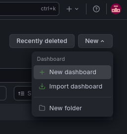

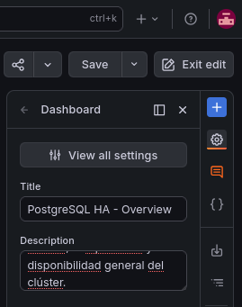

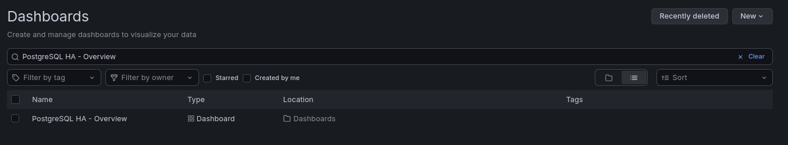

## 2. Crear paneles

### Panel: Primary actual

Queremos identificar visualmente qué nodo PostgreSQL es actualmente el Primary y cuáles son las réplicas.

Primero comprobamos en Prometheus → Query: patroni_primary

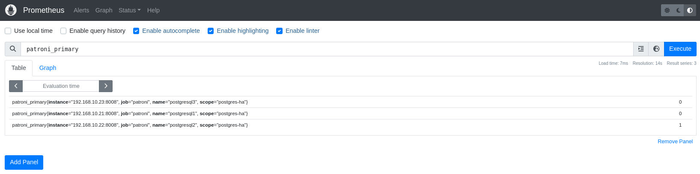
Esta métrica devuelve:

- 1 → el nodo es PRIMARY.
- 0 → el nodo es REPLICA.

### En Grafana creamos el panel

- Entra en dashboard: PostgreSQL HA - Overview.

- Pulsa el *+ de Panel que tienes en la parte derecha

  - Pulsa Configure visualization.

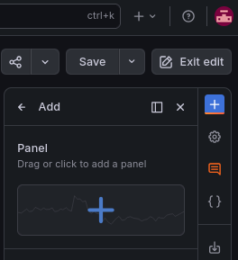

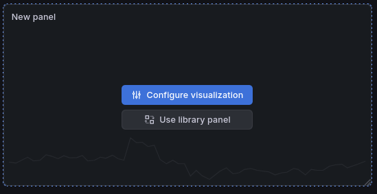

- Abajo en el centro:

  - Data source: prometheus
  - En Query, introduce: patroni_primary
  - Query → Options → Legend → Custom. Añade: {{name}}

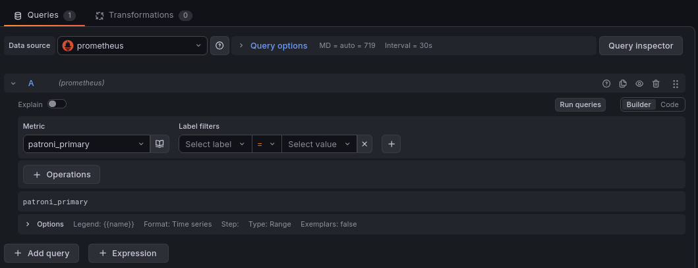

- En la columna de la de derecha:

  - Visualización: Stat

  - Título: PostgreSQL - Primary actual

  - Descripción: Muestra qué nodo PostgreSQL tiene actualmente el rol Primary y cuáles funcionan como réplicas.

  - Abajo de todo de columna en Value mappings → Add value mapping:

    - 0 → REPLICA → naranja
    - 1 → PRIMARY→ verde

- Pulsa Save y guarda también el dashboard.

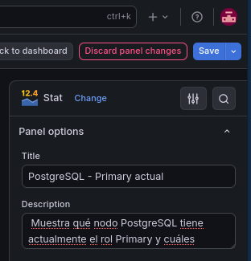

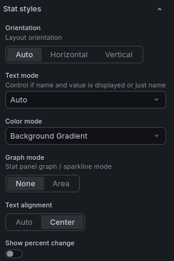

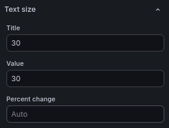

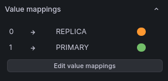

Utiliza patroni_primary para identificar el rol de cada nodo. El valor 1 representa el PRIMARY y 0 una REPLICA, permitiendo detectar visualmente cambios de liderazgo provocados por failover o switchover.

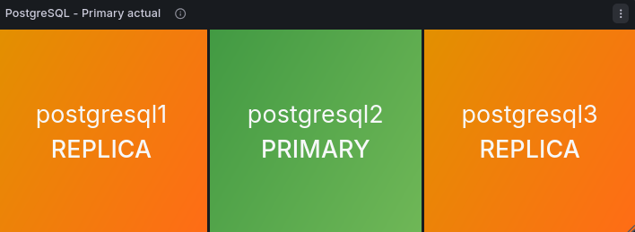

### Panel: Estado de PostgreSQL

Queremos comprobar si PostgreSQL está funcionando en cada nodo, independientemente de que tenga el rol Primary o Replica.

Primero comprobamos en Prometheus → Query: patroni_postgres_running


Esta métrica devuelve:

- 1 → PostgreSQL está activo.
- 0 → PostgreSQL está detenido/no disponible.

### En Grafana creamos el panel

- Entra en dashboard: PostgreSQL HA - Overview.

- Pulsa el *+ de Panel que tienes en la parte derecha

  - Pulsa Configure visualization.

- Abajo en el centro:

  - Data source: prometheus
  - En Query, introduce: patroni_postgres_running
  - Query → Options → Legend → Custom. Añade: {{name}}

- En la columna de la de derecha:

  - Visualización: Stat

  - Título: PostgreSQL - Primary actual

  - Descripción: Muestra si PostgreSQL está activo o no disponible en cada nodo del clúster

  - Abajo de todo de columna en Value mappings → Add value mapping:

    - 0 → DOWN → rojo
    - 1 → UP → verde

- Otras modificaciones al gusto

- Pulsa Save y guarda también el dashboard.

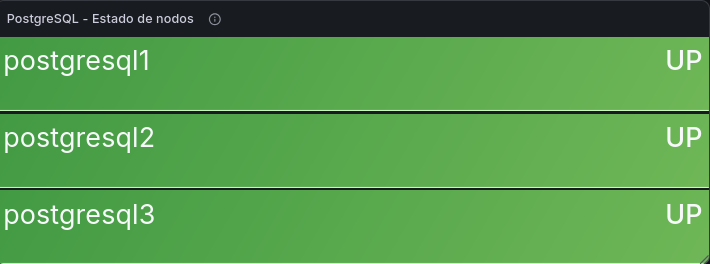

Utiliza patroni_postgres_running para comprobar la disponibilidad de PostgreSQL. El valor 1 representa UP y 0 representa DOWN, permitiendo detectar rápidamente la caída de una instancia.

### Panel: Replication Lag

Queremos medir el retraso de las réplicas respecto al Primary, comprobando cuántos bytes de WAL quedan pendientes de aplicar en cada réplica.

Primero comprobamos en Prometheus → Query: patroni_xlog_replayed_location

Esta métrica indica hasta qué posición del WAL ha aplicado cada réplica. El Primary muestra 0, ya que xlog_replayed_location corresponde a las réplicas.

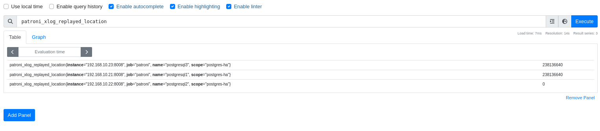

Para calcular el lag real utilizamos:

```promql
scalar(max(patroni_xlog_location))
```


- 
(

patroni_xlog_replayed_location

and on(scope, name)

(patroni_replica == 1)

)

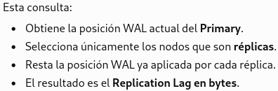

### En Grafana creamos el panel

- Entra en PostgreSQL HA - Overview.
- Add → Panel → Configure visualization.
- En Query cambia Builder → Code.

- Pega:

```promql
scalar(max(patroni_xlog_location))
```


- 
(

patroni_xlog_replayed_location

and on(scope, name)

(patroni_replica == 1)

)

- Query → Options → Legend → Custom → añade {{name}}

- Pulsa Run queries.

- En columna derecha tienes: Standard options → Unit → Choose

  - Selecciona: Data → bytes (SI)

- Umbrales

  - A la derecha abajo del todo. En Thresholds, podemos definir inicialmente:

    - 0 B → Verde
    - 10 MB → Amarillo
    - 100 MB → Rojo

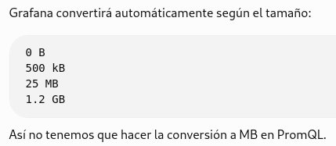

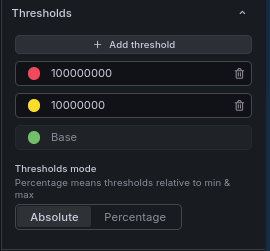

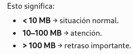

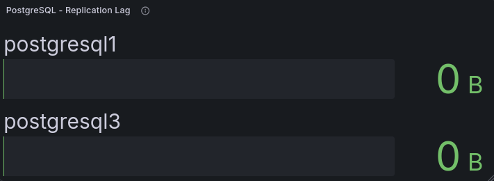

Replication Lag: se calcula restando a la posición WAL actual del Primary la posición WAL ya reproducida por cada réplica. Un valor de 0 B indica sincronización completa; cuanto mayor sea el valor, mayor será el retraso de replicación.

### Panel: Estado de Patroni

Supervisar la disponibilidad de Patroni en cada nodo, permitiendo detectar rápidamente la pérdida de acceso al componente encargado de gestionar la Alta Disponibilidad de PostgreSQL.

Primero, en Prometheus → Query, ejecuta:

```promql
label_replace(
up{job="patroni"},
"name",
"postgresql$1",
"instance",
"192\\.168\\.10\\.2([1-3]):8008"
)
```


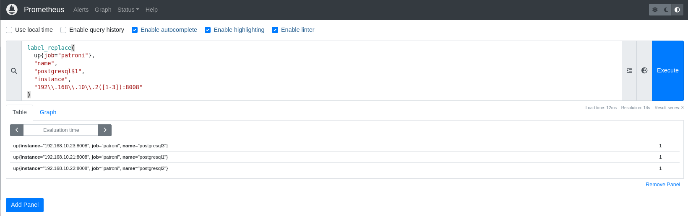

La consulta utiliza la métrica up de Prometheus y añade la etiqueta name a partir de la IP de cada nodo para obtener nombres legibles (postgresql1, postgresql2 y postgresql3).

- 1 → Patroni accesible.
- 0 → Patroni no accesible desde Prometheus.

### En Grafana creamos el panel

- Entra en PostgreSQL HA - Overview.
- Add → Panel → Configure visualization.
- En Query cambia Builder → Code.
- Pega:

```promql
label_replace(
up{job="patroni"},
"name",
"postgresql$1",
"instance",
"192\\.168\\.10\\.2([1-3]):8008"
)
```


- Query → Options → Legend → Custom → {{name}}

- Type → Instant

- Visualización → Stat

- Título: Patroni - Estado de nodos

- Descripción: Muestra si Patroni está accesible en cada nodo del clúster PostgreSQL.

- Value mappings

  - 0 → DOWN → rojo
  - 1 → UP → verde

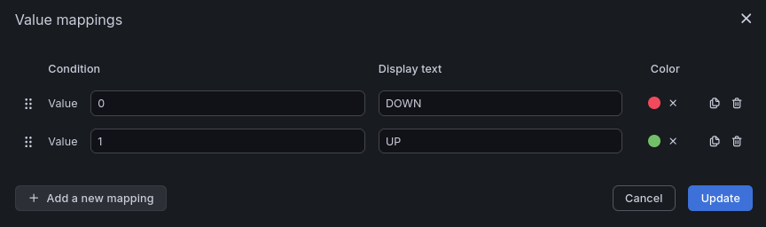

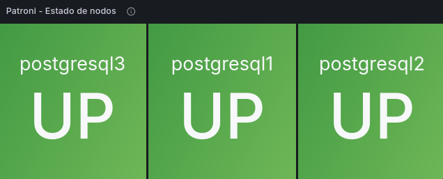

Estado de Patroni: utiliza la métrica up para comprobar si Prometheus puede acceder al endpoint de Patroni de cada nodo. 1 indica UP y 0 indica DOWN, permitiendo detectar la pérdida de disponibilidad de Patroni.

### Panel: Estado de miembros etcd

Detectar rápidamente la pérdida de disponibilidad de cualquiera de los miembros que forman el clúster etcd.

Primero hemos comprobado en Prometheus → Query: up{job="etcd", name!=""}

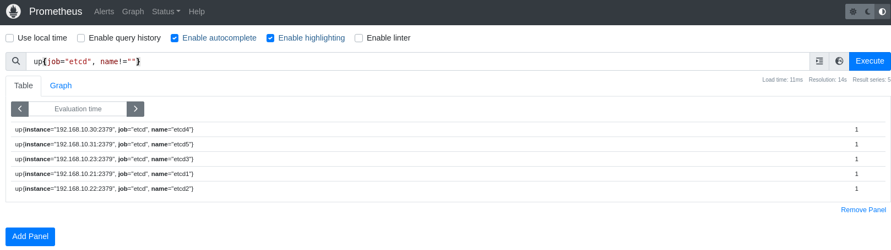

La consulta devuelve un valor por miembro:

- 1 → miembro accesible.
- 0 → miembro no accesible.

### En Grafana creamos el panel

- Entra en PostgreSQL HA - Overview.

- Add → Panel → Configure visualization.

- En Query cambia Builder → Code.

- Pega: up{job="etcd", name!=""}

- Query → Options → Legend → Custom: {{name}}

- Type → Instant

- Visualización → Stat

- Título: etcd - Estado de miembros

- Descripción: Muestra la disponibilidad de cada miembro del clúster etcd.

- Value mappings

  - 0 → DOWN → rojo
  - 1 → UP → verde

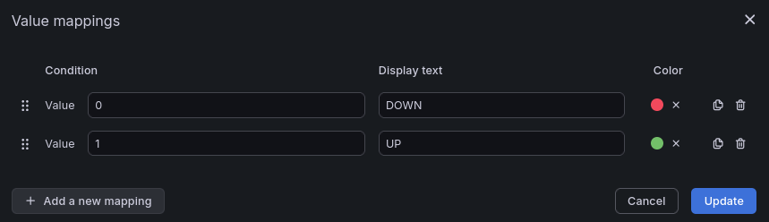

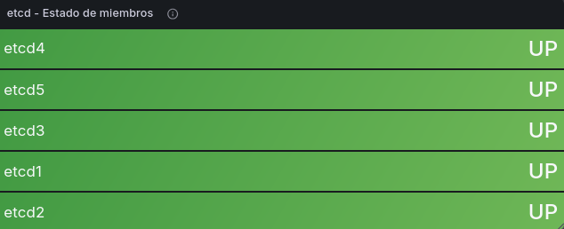

Estado de miembros etcd: utiliza up para comprobar si Prometheus puede acceder a cada miembro de etcd. Un valor 1 indica UP y 0 indica DOWN. Este panel permite detectar rápidamente la pérdida de un miembro del DCS utilizado por Patroni.

### Panel: Leader de etcd

Identificar el Leader actual de etcd y comprobar que el clúster mantiene correctamente un único líder.

Comprobar en Prometheus → Query: etcd_server_is_leader{job="etcd", name!=""}

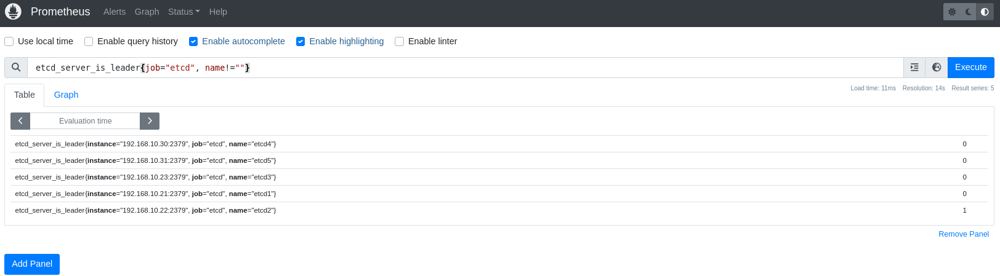

etcd_server_is_leader devuelve:

- 1 para el miembro que es Leader
- 0 para los demás miembros.

### En Grafana creamos el panel

- Entra en PostgreSQL HA - Overview.

- Add → Panel → Configure visualization.

- En Query cambia Builder → Code.

- Pega: etcd_server_is_leader{job="etcd", name!=""}

- Query → Options → Legend → Custom: {{name}}

- Type → Instant

- Selecciona Stat.

- Título: etcd -- Leader

- Descripción: Identifica qué miembro actúa actualmente como Leader del clúster etcd.

- Value mappings

  - 0 → FOLLOWER → verde claro
  - 1 → LEADER → verde oscuro

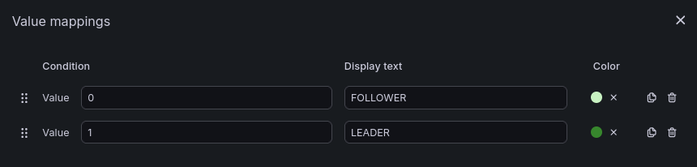

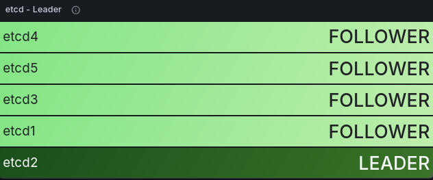

Leader de etcd: utiliza etcd_server_is_leader para identificar el líder actual. El valor 1 representa al LEADER y 0 a los FOLLOWER. En condiciones normales debe existir un único Leader.

### Panel: Leader disponible en etcd

Queremos comprobar que todos los miembros de etcd reconocen la existencia de un Leader, condición fundamental para el funcionamiento normal del consenso del clúster.

Detectar problemas de consenso o comunicación en etcd comprobando que todos los miembros reconocen la existencia de un Leader.

Comprobar en Prometheus → Query: etcd_server_has_leader{job="etcd", name!=""}


- 1 → el miembro reconoce un Leader.
- 0 → el miembro no tiene/ve un Leader.

### En Grafana creamos el panel

- Entra en PostgreSQL HA - Overview.

- Add → Panel → Configure visualization.

- En Query cambia Builder → Code.

- Pega: etcd_server_has_leader{job="etcd", name!=""}

- Query → Options → Legend → Custom: {{name}}

- Type → Instant

- Selecciona Stat.

- Título: etcd - Leader disponible

- Descripción: Muestra si cada miembro de etcd reconoce la existencia de un Leader.

- Value mappings:

  - 0 → NO DETECT LEADER → rojo
  - 1 → OK → verde

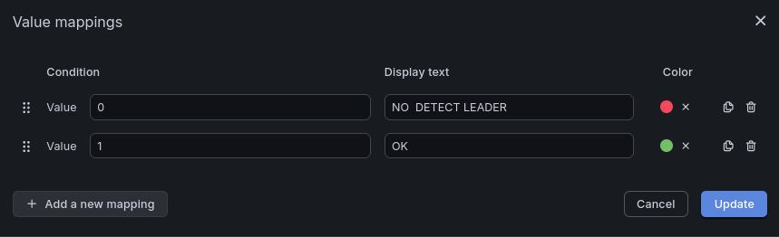

Leader disponible: utiliza etcd_server_has_leader para comprobar que cada miembro reconoce un Leader. Un valor 1 indica funcionamiento normal; 0 puede indicar pérdida de liderazgo, problemas de comunicación o una situación anómala del clúster.

### Panel: HAProxy - Backend Primary

Objetivo: Identificar qué nodo PostgreSQL reconoce HAProxy como Primary y está habilitado para recibir las conexiones del clúster.

Comprobar en Prometheus → Query:

```promql
max by (server) (
haproxy_server_status{
job="haproxy",
proxy="patroni_primary",
state="UP"
}
)
```


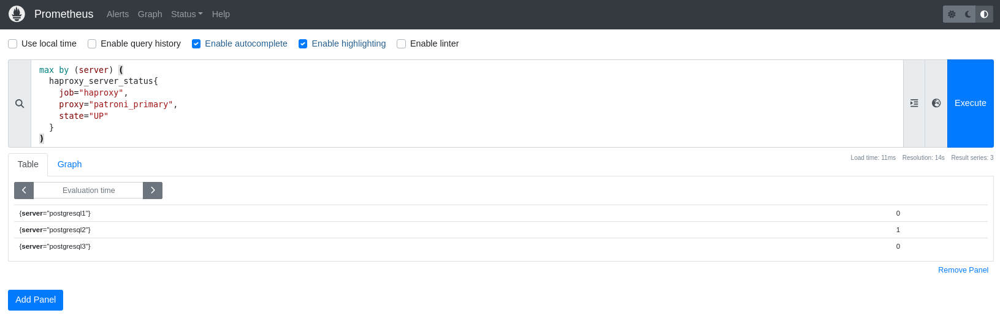

- 0 → NOT PRIMARY
- 1 → PRIMARY

0 no significa DOWN. Significa que ese PostgreSQL no pasa el check /primary porque es una réplica

### En Grafana creamos el panel

- Entra en PostgreSQL HA - Overview.
- Add → Panel → Configure visualization.
- En Query cambia Builder → Code.
- Pega:

```promql
max by (server) (
haproxy_server_status{
job="haproxy",
proxy="patroni_primary",
state="UP"
}
)
```


- Query → Options → Legend → Custom: {{name}}

- Type → Instant

- Selecciona Stat.

- Título: HAProxy - Backend Primary

- Descripción: Muestra qué nodo PostgreSQL identifica HAProxy como Primary y está habilitado para recibir las conexiones dirigidas al backend patroni_primary

- Value mappings:

  - 0 → NOT PRIMARY → gris
  - 1 → PRIMARY → verde

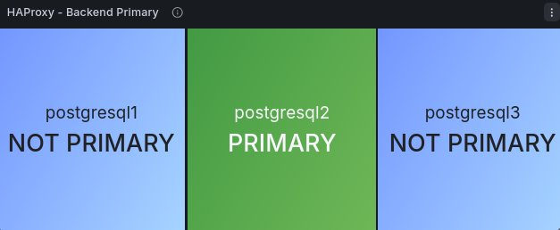

Este panel es bastante útil porque confirma que Patroni y HAProxy están alineados respecto a quién es el Primary.

### Panel: Keepalived - Propietario VIP

Queremos identificar qué nodo HAProxy posee actualmente la VIP PostgreSQL 192.168.10.32 y detectar automáticamente su cambio durante un failover

Probar mética: en Prometheus → Query: keepalived_vip_owner

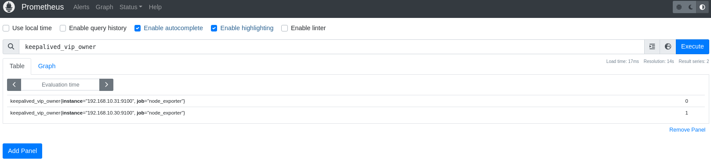

Actualmente devuelve:

- HAProxy-1 → 1 → indica que el nodo posee la VIP
- HAProxy-2 → 0 → indica que actúa como nodo de respaldo

### En Grafana creamos el panel

- Entra en PostgreSQL HA - Overview.
- Add → Panel → Configure visualization.
- En Query cambia Builder → Code.
- Pega:

```promql
label_replace(
label_replace(
keepalived_vip_owner,
"name",
"HAProxy-1",
"instance",
"192\\.168\\.10\\.30:9100"
),
"name",
"HAProxy-2",
"instance",
"192\\.168\\.10\\.31:9100"
)
```


- Query → Options → Legend → Custom: {{name}}

- Type → Instant

- Selecciona Stat.

- Título: Keepalived - Propietario VIP

- Descripción: Identifica qué nodo HAProxy posee actualmente la VIP PostgreSQL.

- Value mappings:

  - 0 → BACKUP → azul claro
  - 1 → VIP OWNER → verde

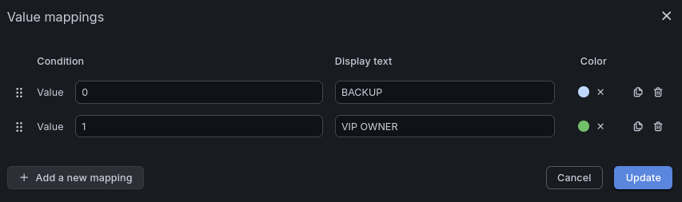

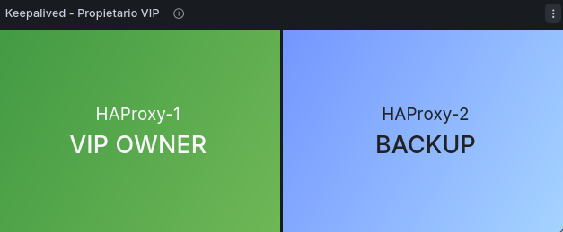

Keepalived - Propietario VIP: utiliza keepalived_vip_owner. El valor 1 identifica al nodo que posee actualmente la VIP y 0 al nodo BACKUP. La métrica se actualiza automáticamente mediante las notificaciones de estado de Keepalived.

### Panel: HAProxy - Estado de nodos

Queremos comprobar que los dos nodos HAProxy están disponibles y Prometheus puede acceder correctamente a sus métricas. C omprobar rápidamente la disponibilidad de los dos nodos HAProxy que proporcionan acceso al clúster PostgreSQL.

Probar métrica: En Prometheus → Query: up{job="haproxy"}

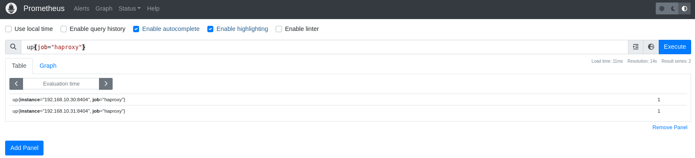

- HAProxy-1 → 1 → HAProxy disponible.
- HAProxy-2 → 1 → HAProxy disponible.

### En Grafana creamos el panel

- Entra en PostgreSQL HA - Overview.
- Add → Panel → Configure visualization.
- En Query cambia Builder → Code.
- Pega:

```promql
label_replace(
label_replace(
up{job="haproxy"},
"name",
"HAProxy-1",
"instance",
"192\\.168\\.10\\.30:8404"
),
"name",
"HAProxy-2",
"instance",
"192\\.168\\.10\\.31:8404"
)
```


- Query → Options → Legend → Custom: {{name}}

- Type → Instant

- Selecciona Stat.

- Título: HAProxy - Estado de nodos

- Descripción: Muestra la disponibilidad de los nodos HAProxy monitorizados por Prometheus.

- Value mappings:

  - 0 → DOWN → rojo
  - 1 → UP → verde

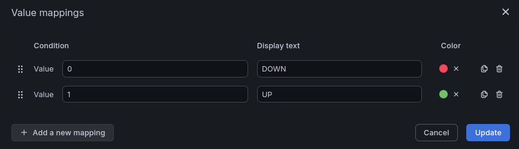

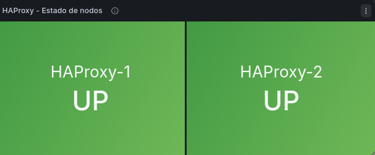

HAProxy - Estado de nodos: utiliza up{job="haproxy"}. El valor 1 indica que Prometheus puede acceder correctamente al endpoint de métricas de HAProxy y 0 que el target no está disponible.

### Organización del dashboard PostgreSQL HA - Overview

Organizar los paneles por capas de la arquitectura HA para facilitar la supervisión y permitir identificar rápidamente en qué componente se encuentra un problema: PostgreSQL/Patroni, replicación, etcd, HAProxy o Keepalived.

1.  Vuelve al dashboard en modo normal.
2.  Coloca el cursor sobre la cabecera/título del panel.
3.  Mantén pulsado y arrastra el panel a la posición deseada.
4.  Para cambiar su tamaño, arrastra desde la esquina inferior derecha.
5.  Grafana recolocará automáticamente los demás paneles en la cuadrícula.
6.  Cuando termines, pulsa Save dashboard.

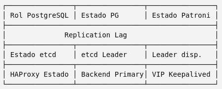

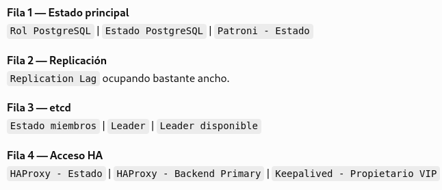

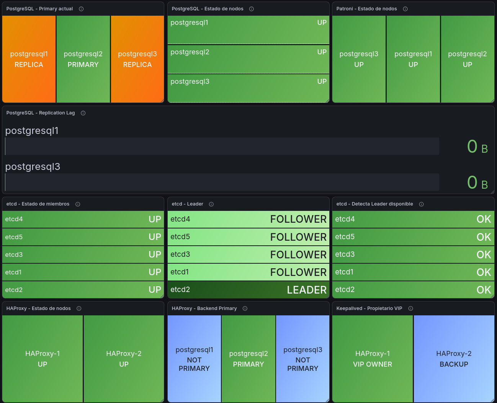

## Prueba HA 1: Switchover controlado de PostgreSQL

### Objetivo

Validar que un cambio controlado de Primary es detectado correctamente por Patroni, HAProxy, Prometheus y Grafana, manteniendo disponible el servicio PostgreSQL.

Durante la prueba comprobaremos especialmente:

- PostgreSQL - Rol de nodos
- PostgreSQL - Estado de nodos
- PostgreSQL - Replication Lag
- Patroni - Estado de nodos
- HAProxy - Backend Primary

### Comprobar estado inicial

En cualquiera de los nodos PostgreSQL ejecuta:

- /opt/patroni/bin/patronictl -c /etc/patroni/patroni.yml list

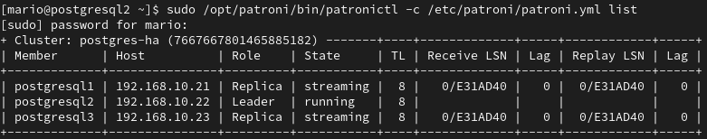

Necesitamos confirmar antes del switchover:

- Qué nodo es Leader.
- Qué nodos son Replica.
- Que los tres están running.
- Que el lag es 0 o mínimo.

### Realizar switchover controlado

Cambiar de forma planificada el Primary de postgresql2 a postgresql1 y comprobar que toda la arquitectura HA detecta correctamente el cambio.

Desde cualquiera de los nodos con patronictl:

- sudo /opt/patroni/bin/patronictl \\

-c /etc/patroni/patroni.yml \\

switchover postgres-ha \\

--leader postgresql2 \\

--candidate postgresql1

Patroni puede pedir confirmación. Confirma el cambio.

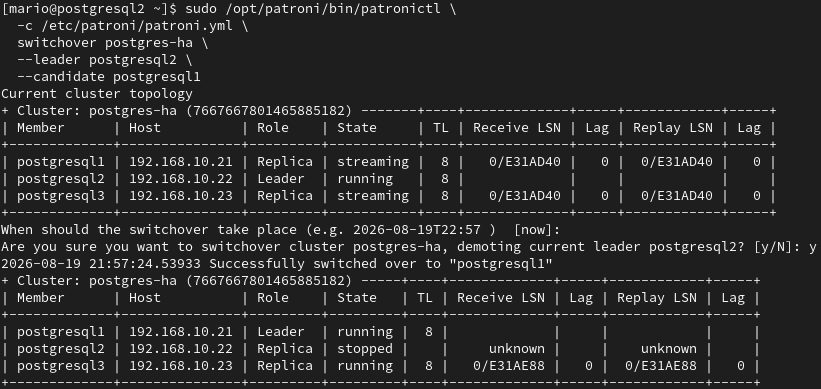

No debería ser necesario modificar HAProxy, Keepalived ni la VIP: Patroni cambia el Primary y HAProxy debe detectarlo mediante su health check.

### Comprobar inmediatamente

Después del switchover ejecuta:

- sudo /opt/patroni/bin/patronictl -c /etc/patroni/patroni.yml list

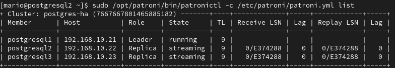

### El switchover ha sido correcto

### Comprobar HAProxy en Prometheus

Verificar que HAProxy ha detectado automáticamente el nuevo Primary mediante Patroni, sin modificar manualmente su configuración.

Ve a Prometheus → Graph/Query y pega:

haproxy_server_status{

job="haproxy",

proxy="patroni_primary",

state="UP"

}

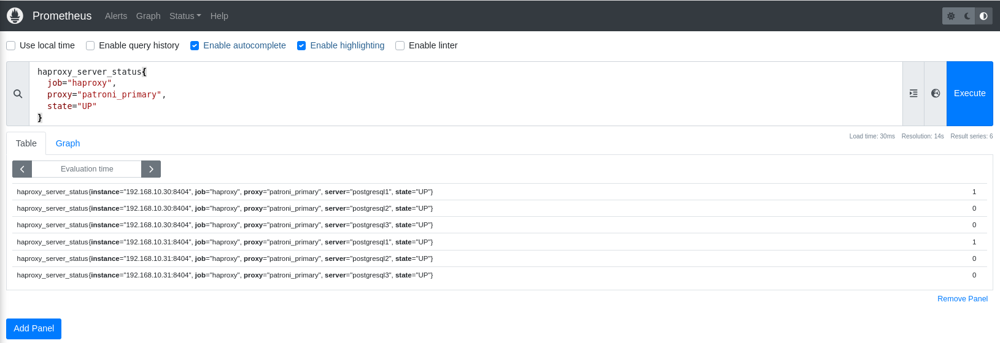

La captura confirma que ambos HAProxy han detectado automáticamente el nuevo Primary:

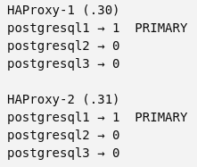

### Comprobación final en Grafana

Verificar que el dashboard PostgreSQL HA - Overview refleja correctamente el switchover realizado.

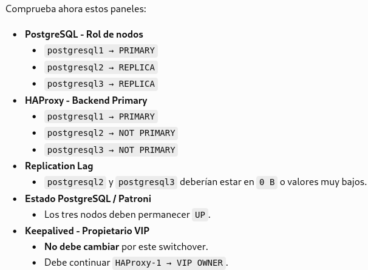

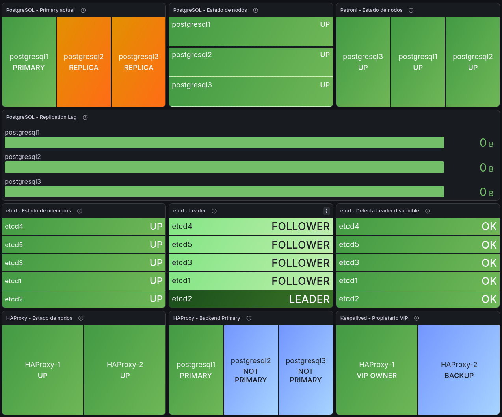

Resultado: el switchover de postgresql2 a postgresql1 se realizó correctamente. Patroni promovió postgresql1 a Leader y las otras dos instancias permanecieron como réplicas en streaming sin lag. Ambos HAProxy detectaron automáticamente el nuevo Primary y actualizaron su backend sin necesidad de modificar la configuración. El dashboard de Grafana debe reflejar automáticamente estos cambios.

## Prueba HA 2: Failover de Keepalived / VIP

### Objetivo

Validar que, ante la caída controlada de Keepalived en el nodo propietario, la VIP PostgreSQL 192.168.10.32 migra automáticamente de HAProxy-1 a HAProxy-2, y que Grafana refleja correctamente el cambio.

### Estado inicial

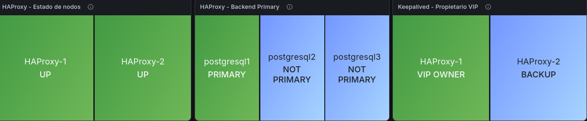

### Confirmar propietario antes de la prueba

En HAProxy-1 y HAProxy-2:

- ip -4 addr show | grep "192.168.10.32"

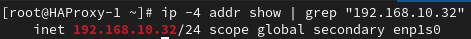

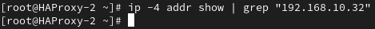

### HAProxy-1 tiene la VIP

### Provocar el failover

en HAProxy-1 detendremos Keepalived:

- sudo systemctl stop keepalived

Esto simula la pérdida de la capa Keepalived del nodo que actualmente posee la VIP.

Comprobar que la VIP haya migrado físicamente a HAProxy-2


La salida confirma que 192.168.10.32 está ahora en HAProxy-2:

Esta prueba valida el mecanismo de redundancia de Keepalived de forma independiente al clúster PostgreSQL. El Primary PostgreSQL debe continuar siendo postgresql1; únicamente debe cambiar el nodo HAProxy propietario de la VIP.

### Comprobar la métrica en Prometheus

Ahora ejecuta en Prometheus → Query: keepalived_vip_owner


- 192.168.10.30 → HAProxy-1 → 0 → BACKUP
- 192.168.10.31 → HAProxy-2 → 1 → VIP OWNER

Tras detener Keepalived en HAProxy-1, la VIP PostgreSQL 192.168.10.32 migró automáticamente a HAProxy-2. La métrica keepalived_vip_owner, actualizada mediante un systemd timer, detectó correctamente el nuevo propietario y Prometheus refleja HAProxy-1 = 0 y HAProxy-2 = 1. Se valida así tanto el failover de la VIP como su monitorización automática.

### Comprobar el failover de la VIP en Grafana

Entra en el dashboard PostgreSQL HA - Overview y localiza: Keepalived - Propietario VIP


La captura confirma exactamente lo esperado:

- HAProxy - Estado de nodos: HAProxy-1 y HAProxy-2 continúan UP.
- HAProxy - Backend Primary: postgresql1 continúa siendo PRIMARY.
- Keepalived - Propietario VIP: HAProxy-1 ha pasado a BACKUP y HAProxy-2 a VIP OWNER.

Al detener Keepalived en HAProxy-1, la VIP 192.168.10.32 migró automáticamente a HAProxy-2. Prometheus detectó correctamente el cambio mediante keepalived_vip_owner y Grafana actualizó el panel Keepalived - Propietario VIP. HAProxy permaneció operativo en ambos nodos y el Primary PostgreSQL no cambió.

## Prueba: Validación de estados de fallo en Grafana

Se realizaron pruebas controladas para comprobar que el dashboard PostgreSQL HA - Overview representa correctamente los fallos mediante estados DOWN en rojo.

### Caída de HAProxy

Se detuvo HAProxy-2:

- sudo systemctl stop haproxy


Restauración:

- sudo systemctl start haproxy

### Caída de Patroni/PostgreSQL

### Se detuvo Patroni en una réplica (postgresql3)

- sudo systemctl stop patroni


Restauración:

- sudo systemctl start patroni

### Caída de un miembro etcd

Como etcd2 es el líder, probamos con etcd3.

En postgresql3:

- sudo systemctl stop etcd


El clúster mantuvo líder y quorum.

Restauración:

-sudo systemctl start etcd

### Caída de etcd leader

Para probar la caída del líder etcd entra en postgresql2 y ejecuta:

- sudo systemctl stop etcd


etcd1 → elegido automáticamente como nuevo LEADER

Esto confirma que etcd tolera correctamente la caída de su líder y realiza una nueva elección automáticamente.
