# HA PostgreSQL con Patroni, etcd y HAProxy

## Topología

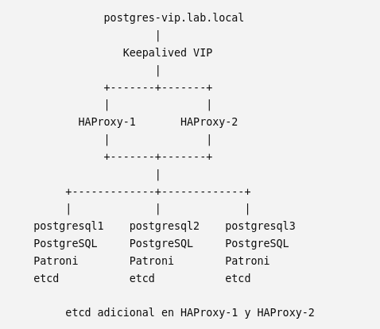

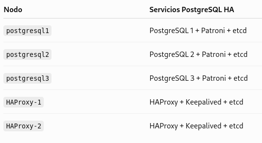

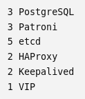

## 1. Instalar PostgreSQL en 3 nodos (postgresql1-3)

```bash
dnf install -y \
    postgresql-server \
    postgresql \
    postgresql-contrib
```

- psql --version

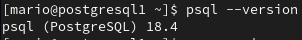

Inicializa el clúster

Inicializar manualmente el clúster PostgreSQL no era necesario para el despliegue final con Patroni. Ese comando crea un clúster PostgreSQL independiente (PGDATA). Patroni es quien realiza el bootstrap.

Habilita el servicio

- systemctl enable --now postgresql-18.service

- systemctl status postgresql

## 2. Instalar etcd en los 5 nodos (postgresql1-3 y HAProxy1-2)

Tendremos un clúster etcd de 5 miembros:

- postgresql1
- postgresql2
- postgresql2

- HAProxy-1
- HAProxy-2

etcd es una base de datos distribuida clave-valor diseñada para almacenar información crítica de coordinación de un clúster, es decir, será la "base de datos de coordinación" del clúster:

- Mantiene el estado del clúster y registra quién es el líder (Primary).

- Mantiene el consenso entre los nodos mediante quórum.

- Evita el split-brain, ayudando a impedir que existan dos líderes simultáneamente.

- Coordina las elecciones de líder cuando el Primary deja de estar disponible.

- Permite el failover automático, proporcionando a Patroni la información necesaria para promocionar una réplica.

- Almacena configuración y metadatos distribuidos que Patroni utiliza para coordinar el clúster.

- Detecta la pérdida del liderazgo mediante leases/TTL: si el líder deja de renovar su bloqueo, Patroni puede iniciar una nueva elección.

Instalar etcd

Rocky Linux 9 no dispone del paquete etcd en sus repositorios oficiales (BaseOS, AppStream, Extras) ni en EPEL. Por este motivo, se ha optado por instalar el binario oficial de etcd, descargado directamente

- cd /usr/local/src

-curl -LO <https://github.com/etcd-io/etcd/releases/download/v3.5.21/etcd-v3.5.21-linux-amd64.tar.gz>

-tar -xzf etcd-v3.5.21-linux-amd64.tar.gz

-cp etcd-v3.5.21-linux-amd64/etcd /usr/local/bin

→ Copia el servidor etcd que ejecuta y mantiene el clúster etcd

-cp etcd-v3.5.21-linux-amd64/etcdctl /usr/local/bin/

→ Copia la herramienta CLI para administrar y consultar el clúster etcd

- cp etcd-v3.5.21-linux-amd64/etcdutl /usr/local/bin/

→ Copia la utilidad para tareas de mantenimiento y recuperación, como trabajar con snapshots

- chmod +x /usr/local/bin/etcd\*

Comprueba:

- etcd --version

- etcdctl version

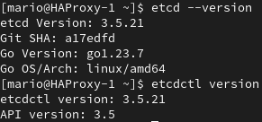

Crear el usuario (en los 5 nodos)

Se crea un usuario de sistema exclusivo para etcd para ejecutar el servicio de forma segura, sin permitir inicio de sesión interactivo

- useradd --system --home-dir /var/lib/etcd --shell /sbin/nologin etcd

- id etcd

Crear los directorios y asigna permisos (en los 5 nodos)

- mkdir -p /etc/etcd

- mkdir -p /var/lib/etcd

- chown -R etcd:etcd /etc/etcd /var/lib/etcd

- chmod 700 /var/lib/etcd

Crear el servicio systemd (en los 5 nodos)

- Crea el fichero: vi /etc/systemd/system/etcd.service

Añade:

```ini
[Unit]
Description=etcd
Documentation=https://etcd.io/docs/
# Espera a que la red esté completamente disponible
After=network-online.target
Wants=network-online.target
[Service]
# Permite a etcd notificar a systemd cuando está listo
Type=notify
# Ejecuta etcd con su usuario dedicado, no como root
User=etcd
Group=etcd
# Inicia etcd utilizando nuestro fichero de configuración
ExecStart=/usr/local/bin/etcd --config-file=/etc/etcd/etcd.conf.yml
# Reinicia automáticamente etcd si el proceso falla
Restart=always
# Espera 5 segundos antes de intentar reiniciarlo
RestartSec=5
# Aumenta el límite de archivos/descriptores abiertos
LimitNOFILE=65536
[Install]
# Permite iniciar etcd automáticamente durante el arranque del sistema
WantedBy=multi-user.target
```

- systemctl daemon-reload

- systemctl status etcd

Es normal que aparezca “inactive (dead)” o “failed” porque todavía no hemos creado /etc/etcd/etcd.conf.yml.

¿Por qué hacemos esto? Dejamos preparado el servicio para que, una vez creada la configuración, solo tengamos que ejecutar “systemctl enable --now etcd” y todos los nodos arranquen exactamente igual.

Crear etcd.conf.yml (en los 5 nodos)

En cada nodo crea:

- vi /etc/etcd/etcd.conf.yml

**postgresql1 - 192.168.10.21**

```yaml
# Nombre único de este miembro dentro del clúster etcd
name: etcd1
# Directorio donde etcd almacena sus datos
data-dir: /var/lib/etcd
# Dirección para comunicarse con los demás nodos etcd
listen-peer-urls: http://192.168.10.21:2380
# Direcciones donde acepta conexiones de clientes (Patroni, etcdctl...)
listen-client-urls: http://192.168.10.21:2379,http://127.0.0.1:2379
# Dirección que anuncia a los demás miembros del clúster
initial-advertise-peer-urls: http://192.168.10.21:2380
# Dirección que anuncia a los clientes
advertise-client-urls: http://192.168.10.21:2379
# Define los 5 miembros que formarán inicialmente el clúster etcd
initial-cluster: etcd1=http://192.168.10.21:2380,etcd2=http://192.168.10.22:2380,etcd3=http://192.168.10.23:2380,etcd4=http://192.168.10.30:2380,etcd5=http://192.168.10.31:2380
# Indica que estamos creando un clúster nuevo
initial-cluster-state: new
# Identificador común para este clúster
initial-cluster-token: postgres-cluster
```

**postgresql2 - 192.168.10.22**

```yaml
name: etcd2
data-dir: /var/lib/etcd
listen-peer-urls: http://192.168.10.22:2380
listen-client-urls: http://192.168.10.22:2379,http://127.0.0.1:2379
initial-advertise-peer-urls: http://192.168.10.22:2380
advertise-client-urls: http://192.168.10.22:2379
initial-cluster: etcd1=http://192.168.10.21:2380,etcd2=http://192.168.10.22:2380,etcd3=http://192.168.10.23:2380,etcd4=http://192.168.10.30:2380,etcd5=http://192.168.10.31:2380
initial-cluster-state: new
initial-cluster-token: postgres-cluster
```

**postgresql3 - 192.168.10.23**

```yaml
name: etcd3
data-dir: /var/lib/etcd
listen-peer-urls: http://192.168.10.23:2380
listen-client-urls: http://192.168.10.23:2379,http://127.0.0.1:2379
initial-advertise-peer-urls: http://192.168.10.23:2380
advertise-client-urls: http://192.168.10.23:2379
initial-cluster: etcd1=http://192.168.10.21:2380,etcd2=http://192.168.10.22:2380,etcd3=http://192.168.10.23:2380,etcd4=http://192.168.10.30:2380,etcd5=http://192.168.10.31:2380
initial-cluster-state: new
initial-cluster-token: postgres-cluster
```

**HAProxy-1 - 192.168.10.30**

```yaml
name: etcd4
data-dir: /var/lib/etcd
listen-peer-urls: http://192.168.10.30:2380
listen-client-urls: http://192.168.10.30:2379,http://127.0.0.1:2379
initial-advertise-peer-urls: http://192.168.10.30:2380
advertise-client-urls: http://192.168.10.30:2379
initial-cluster: etcd1=http://192.168.10.21:2380,etcd2=http://192.168.10.22:2380,etcd3=http://192.168.10.23:2380,etcd4=http://192.168.10.30:2380,etcd5=http://192.168.10.31:2380
initial-cluster-state: new
initial-cluster-token: postgres-cluster
```

**HAProxy-2 - 192.168.10.31**

```yaml
name: etcd5
data-dir: /var/lib/etcd
listen-peer-urls: http://192.168.10.31:2380
listen-client-urls: http://192.168.10.31:2379,http://127.0.0.1:2379
initial-advertise-peer-urls: http://192.168.10.31:2380
advertise-client-urls: http://192.168.10.31:2379
initial-cluster: etcd1=http://192.168.10.21:2380,etcd2=http://192.168.10.22:2380,etcd3=http://192.168.10.23:2380,etcd4=http://192.168.10.30:2380,etcd5=http://192.168.10.31:2380
initial-cluster-state: new
initial-cluster-token: postgres-cluster
```

Asigna propietraio y permisos en los 5 nodos

- chown etcd:etcd /etc/etcd/etcd.conf.yml

- chmod 640 /etc/etcd/etcd.conf.yml

Abrir puertos (en los 5 nodos)

En los 5 nodos:

- firewall-cmd --permanent --add-port=2379/tcp

- firewall-cmd --permanent --add-port=2380/tcp

- firewall-cmd --reload

- firewall-cmd --list-ports

- 2379: conexiones de Patroni y etcdctl.
- 2380: comunicación interna entre miembros etcd.

Comprobar directorio vacío (en los 5 nodos)

Solo para este primer arranque. Debe estar vacío

- ls -la /var/lib/etcd

- rm -rf /var/lib/etcd/\*

Arrancar etcd (en los 5 nodos)

Ejecuta en los 5 nodos, uno detrás de otro:

- systemctl daemon-reload

- systemctl enable --now etcd

Realizarlo en los 5 nodos seguidos ya que esta configurado como quorum y hasta que no realizas esto en todos los nodos no va a funcionar. Asique es probable que dichos comandos no funcionen hasta que los ejecutes en los 5 nodos.

- systemctl status etcd --no-pager

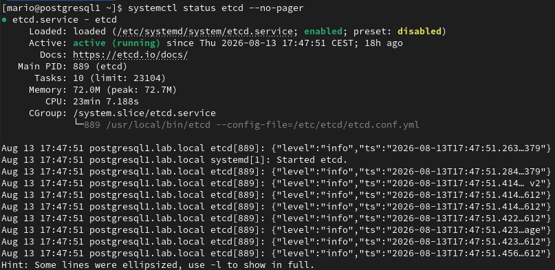

Mostrar estado de etcd

Muestra el estado detallado de los 5 nodos etcd: versión, tamaño de la base de datos, cuál es el líder, término e índices Raft, entre otros datos.

Desde nodo con etcd:

- export ETCDCTL_API=3

- etcdctl --endpoints=http://192.168.10.21:2379,http://192.168.10.22:2379,http://192.168.10.23:2379,http://192.168.10.30:2379,http://192.168.10.31:2379 endpoint status --write-out=table

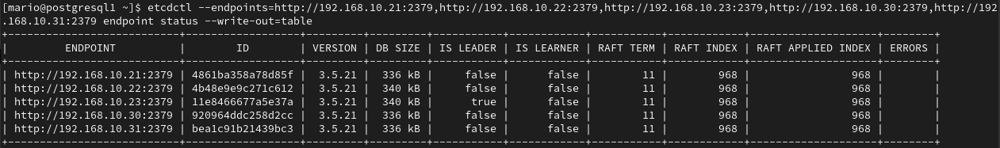

El resultado es correcto: muestra 5 nodos y uno de ellos como lider

Mostrar salid de etcd

Comprueba la salud de los 5 nodos etcd, verificando que cada endpoint está accesible y puede responder correctamente.

- etcdctl --endpoints=http://192.168.10.21:2379,http://192.168.10.22:2379,http://192.168.10.23:2379,http://192.168.10.30:2379,http://192.168.10.31:2379 endpoint health --write-out=table

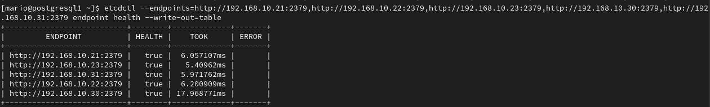

El resultado es correcto: muestra 5 nodos etcd con estado saludable

¿Para qué sirve ETCDCTL_API=3? etcdctl soportó durante años dos APIs:

- API v2 (antigua, obsoleta).
- API v3 (actual, usada por Patroni y Kubernetes).

La variable “export ETCDCTL_API=3” le indica a etcdctl que utilice la API v3.

Con la versión 3.5.x que tienes, realmente ya no suele ser necesaria, porque v3 es la API por defecto. Aun así, muchos manuales la siguen incluyendo por compatibilidad con versiones anteriores.

## 3. Instalar Patroni en 3 nodos postgresql (en un entorno virtual venv)

Ventajas de usar entorno virtual

- No mezcla dependencias con el sistema.
- Las actualizaciones de Python del SO no afectan a Patroni.
- Es la recomendación del proyecto Patroni.
- Más fácil actualizar o hacer rollback

Detener PostgreSQL

Patroni deberá controlar PostgreSQ

- systemctl stop postgresql

- systemctl disable postgresql

Comprueba:

- systemctl is-active postgresql

- systemctl is-enabled postgresql

Crear el entorno virtual

Para mantener Patroni y sus dependencias Python aislados del sistema, utilizaremos un entorno virtual dedicado en /opt/patroni.

Instalar soporte para venv y crear el entorno virtual de Patroni

- dnf install -y python3 python3-pip

- python3 -m venv /opt/patroni

Crea un entorno Python independiente en /opt/patroni, que utilizaremos exclusivamente para Patroni.

Actualiza las herramientas del entorno:

- /opt/patroni/bin/python -m pip install --upgrade pip setuptools wheel

Actualiza las herramientas necesarias para instalar y gestionar correctamente los paquetes Python dentro del entorno.

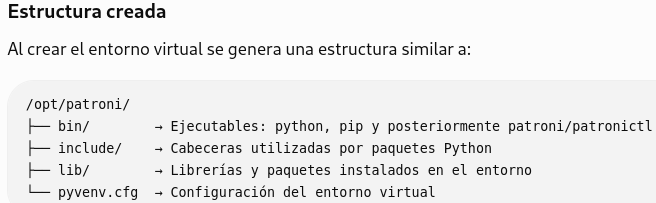

Instalar Patroni

Como utilizamos etcd mediante la API v3 y PostgreSQL 18, instalamos Patroni con los componentes necesarios:

- /opt/patroni/bin/pip install "patroni[etcd3,psycopg3]"

- etcd3 → permite a Patroni utilizar etcd como sistema distribuido de coordinación (DCS) mediante su API v3.
- psycopg3 → controlador Python que permite a Patroni comunicarse con PostgreSQL.

Comprobar

/opt/patroni/bin/patroni --version

/opt/patroni/bin/patronictl version

/opt/patroni/bin/python -c "import psycopg; print(psycopg.__version__)"

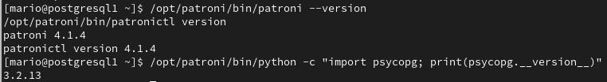

No se necesita ejecutar “source /opt/patroni/bin/activate” para el servicio. Usaremos siempre las rutas completas de /opt/patroni/bin/.

¿Qué hace source /opt/patroni/bin/activate? Simplemente modifica tu sesión de la shell para que, al escribir (python, pip, patroni) el sistema utilice automáticamente los binarios del entorno virtual.

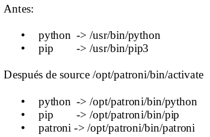

Crear directorios (3 workers)

- mkdir -p /etc/patroni

- mkdir -p /var/log/patroni

- chown -R postgres:postgres /etc/patroni /var/log/patroni

- chmod 750 /etc/patroni

Comprobar PostgreSQL

Necesitamos conocer las rutas que usará Patroni. Ejecuta en un nodo postgresql:

- which postgres
- which pg_ctl
- which initdb
- rpm -ql postgresql-server \| grep "/bin/"

Con esta salida construiremos el patroni.yml correctamente. Es importante porque Patroni necesita saber dónde están los binarios (postgres, pg_ctl, pg_basebackup, etc.), y esa ruta depende de cómo esté empaquetado PostgreSQL

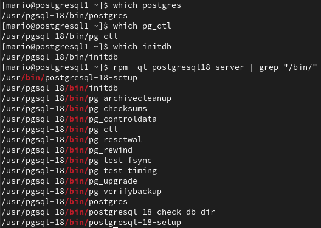

Limpiar el PostgreSQL inicial en caso de ser haber sido inicializado

Como Patroni debe crear y gestionar el clúster, eliminaremos el data directory creado con postgresql-18-setup --initdb.

- systemctl stop postgresql

- systemctl disable postgresql

- rm -rf /var/lib/pgsql/data/\*

- ls -la /var/lib/pgsql/data

El primer nodo será inicializado por Patroni como primary. Los otros dos se crearán automáticamente como réplicas mediante pg_basebackup.

No arranques ya el servicio postgresql. Desde este punto, PostgreSQL será controlado únicamente por Patroni.

Crear patroni.yml (en 3 nodos)

Ahora crearemos los tres archivos patroni.yml, pero antes necesitamos definir las contraseñas.

Usaremos inicialmente:

- Superusuario postgres: <POSTGRES_PASSWORD>

  - Es el superusuario de PostgreSQL. Patroni lo utiliza para tareas administrativas sobre la instancia

- Usuario replicación: <REPLICATOR_PASSWORD>

  - Usuario dedicado a la replicación física
  - Las réplicas (postgresql2/3) lo utilizan para recibir los WAL del Primary y para el clonado mediante pg_basebackup.

- Usuario rewind: <REWIND_PASSWORD>

  - Usuario utilizado por pg_rewind para ayudar a reintegrar un antiguo Primary como réplica después de un failover.

**postgresql1 - 192.168.10.21**

```yaml
cat > /etc/patroni/patroni.yml <<'EOF'
# Nombre del clúster PostgreSQL.
# Todos los nodos deben tener el mismo "scope".
scope: postgres-ha
# Ruta (namespace) donde Patroni almacenará la información del clúster en etcd.
namespace: /service/
# Nombre único de este nodo dentro del clúster.
# Debe ser distinto en cada servidor.
name: postgresql1
# -------------------------------------------------------------------
# API REST de Patroni
# Se utiliza para administración, monitorización y failover.
# -------------------------------------------------------------------
restapi:
  # Dirección donde escucha la API REST.
  listen: 0.0.0.0:8008
  # Dirección mediante la cual el resto de nodos accederán a este Patroni.
  connect_address: 192.168.10.21:8008
# -------------------------------------------------------------------
# Configuración del clúster etcd
# Patroni utiliza etcd para decidir quién es el Primary y
# coordinar las promociones y failovers.
# -------------------------------------------------------------------
etcd3:
  hosts:
    - 192.168.10.21:2379
    - 192.168.10.22:2379
    - 192.168.10.23:2379
    - 192.168.10.30:2379
    - 192.168.10.31:2379
# -------------------------------------------------------------------
# Configuración inicial del clúster PostgreSQL.
# SOLO se ejecuta la primera vez que se crea el clúster.
# Después la configuración se almacena en etcd.
# -------------------------------------------------------------------
bootstrap:
  dcs:
    # Tiempo (segundos) que un nodo mantiene el "liderazgo"
    # si deja de comunicarse con etcd.
    ttl: 30
    # Cada cuántos segundos Patroni comprueba el estado del clúster.
    loop_wait: 10
    # Tiempo máximo para reintentar operaciones antes de considerarlas fallidas.
    retry_timeout: 10
    # Máximo retraso permitido de una réplica para poder promocionarla.
    maximum_lag_on_failover: 1048576
    postgresql:
      # Permite usar pg_rewind para reintegrar rápidamente
      # un antiguo Primary al clúster.
      use_pg_rewind: true
      # Activa replication slots.
      # Evita perder WAL cuando una réplica está desconectada.
      use_slots: true
      # Parámetros que Patroni aplicará a PostgreSQL.
      parameters:
        # Necesario para replicación física.
        wal_level: replica
        # Permite consultas de solo lectura en réplicas.
        hot_standby: "on"
        # Número máximo de procesos de replicación.
        max_wal_senders: 10
        # Número máximo de replication slots.
        max_replication_slots: 10
        # Cantidad mínima de WAL que se conserva.
        wal_keep_size: 256MB
      # -----------------------------------------------------------------
      # Opciones utilizadas cuando Patroni inicializa PostgreSQL
      # por primera vez.
      # -----------------------------------------------------------------
      initdb:
        # Base de datos en UTF8.
        - encoding: UTF8
        # Activa checksums para detectar corrupción de datos.
        - data-checksums
      # -----------------------------------------------------------------
      # Reglas de autenticación (pg_hba.conf)
      # Patroni generará automáticamente este fichero.
      # -----------------------------------------------------------------
      pg_hba:
        # Permite replicación desde la red interna.
        - host replication replicator 192.168.10.0/24 scram-sha-256
        # Permite conexiones normales desde la red interna.
        - host all all 192.168.10.0/24 scram-sha-256
        # Permite conexiones locales TCP.
        - host all all 127.0.0.1/32 scram-sha-256
        # Conexiones locales mediante socket Unix.
        - local all all peer
      # -----------------------------------------------------------------
      # Usuarios creados automáticamente al inicializar el clúster.
      # -----------------------------------------------------------------
      users:
        rewind_user:
          password: <REWIND_PASSWORD>
          options:
            - createrole
            - createdb
# -------------------------------------------------------------------
# Configuración local de PostgreSQL
# -------------------------------------------------------------------
postgresql:
  # Dirección donde PostgreSQL escuchará conexiones.
  listen: 0.0.0.0:5432
  # Dirección que utilizarán clientes y réplicas.
  connect_address: 192.168.10.21:5432
  # Directorio de datos PostgreSQL.
  data_dir: /var/lib/pgsql/18/data
  # Ruta de los binarios PostgreSQL.
  bin_dir: /usr/pgsql-18/bin
  # -----------------------------------------------------------------
  # Usuarios utilizados internamente por Patroni.
  # -----------------------------------------------------------------
  authentication:
    # Usuario para replicación física.
    replication:
      username: replicator
      password: <REPLICATOR_PASSWORD>
    # Superusuario PostgreSQL.
    superuser:
      username: postgres
      password: <POSTGRES_PASSWORD>
    # Usuario utilizado por pg_rewind.
    rewind:
      username: rewind_user
      password: <REWIND_PASSWORD>
  # Directorio de sockets Unix.
  parameters:
    unix_socket_directories: /var/run/postgresql
  # Método utilizado para crear nuevas réplicas.
  create_replica_methods:
    - basebackup
  # Opciones de pg_basebackup.
  basebackup:
    # Fuerza un checkpoint rápido antes del backup.
    checkpoint: fast
# -------------------------------------------------------------------
# Etiquetas del nodo.
# Permiten controlar el comportamiento de Patroni.
# -------------------------------------------------------------------
tags:
  # Si es true, este nodo nunca será promocionado.
  nofailover: false
  # Si es true, no se usará para balanceo de lectura.
  noloadbalance: false
  # Si es true, se preferirá este nodo para clonar réplicas.
  clonefrom: false
  # Si es true, no participará como réplica síncrona.
  nosync: false
EOF
```

**postgresql2 - 192.168.10.22**

```yaml
cat > /etc/patroni/patroni.yml <<'EOF'
scope: postgres-ha
namespace: /service/
name: postgresql2
restapi:
  listen: 0.0.0.0:8008
  connect_address: 192.168.10.22:8008
etcd3:
  hosts:
    - 192.168.10.21:2379
    - 192.168.10.22:2379
    - 192.168.10.23:2379
    - 192.168.10.30:2379
    - 192.168.10.31:2379
bootstrap:
  dcs:
    ttl: 30
    loop_wait: 10
    retry_timeout: 10
    maximum_lag_on_failover: 1048576
    postgresql:
      use_pg_rewind: true
      use_slots: true
      parameters:
        wal_level: replica
        hot_standby: "on"
        max_wal_senders: 10
        max_replication_slots: 10
        wal_keep_size: 256MB
      initdb:
        - encoding: UTF8
        - data-checksums
      pg_hba:
        - host replication replicator 192.168.10.0/24 scram-sha-256
        - host all all 192.168.10.0/24 scram-sha-256
        - host all all 127.0.0.1/32 scram-sha-256
        - local all all peer
      users:
        rewind_user:
          password: <REWIND_PASSWORD>
          options:
            - createrole
            - createdb
postgresql:
  listen: 0.0.0.0:5432
  connect_address: 192.168.10.22:5432
  data_dir: /var/lib/pgsql/18/data
  bin_dir: /usr/pgsql-18/bin
  authentication:
    replication:
      username: replicator
      password: <REPLICATOR_PASSWORD>
    superuser:
      username: postgres
      password: <POSTGRES_PASSWORD>
    rewind:
      username: rewind_user
      password: <REWIND_PASSWORD>
  parameters:
    unix_socket_directories: /var/run/postgresql
  create_replica_methods:
    - basebackup
  basebackup:
    checkpoint: fast
tags:
  nofailover: false
  noloadbalance: false
  clonefrom: false
  nosync: false
EOF
```

**postgresql3 - 192.168.10.23**

```yaml
cat > /etc/patroni/patroni.yml <<'EOF'
scope: postgres-ha
namespace: /service/
name: postgresql3
restapi:
  listen: 0.0.0.0:8008
  connect_address: 192.168.10.23:8008
etcd3:
  hosts:
    - 192.168.10.21:2379
    - 192.168.10.22:2379
    - 192.168.10.23:2379
    - 192.168.10.30:2379
    - 192.168.10.31:2379
bootstrap:
  dcs:
    ttl: 30
    loop_wait: 10
    retry_timeout: 10
    maximum_lag_on_failover: 1048576
    postgresql:
      use_pg_rewind: true
      use_slots: true
      parameters:
        wal_level: replica
        hot_standby: "on"
        max_wal_senders: 10
        max_replication_slots: 10
        wal_keep_size: 256MB
      initdb:
        - encoding: UTF8
        - data-checksums
      pg_hba:
        - host replication replicator 192.168.10.0/24 scram-sha-256
        - host all all 192.168.10.0/24 scram-sha-256
        - host all all 127.0.0.1/32 scram-sha-256
        - local all all peer
      users:
        rewind_user:
          password: <REWIND_PASSWORD>
          options:
            - createrole
            - createdb
postgresql:
  listen: 0.0.0.0:5432
  connect_address: 192.168.10.23:5432
  data_dir: /var/lib/pgsql/18/data
  bin_dir: /usr/pgsql-18/bin
  authentication:
    replication:
      username: replicator
      password: <REPLICATOR_PASSWORD>
    superuser:
      username: postgres
      password: <POSTGRES_PASSWORD>
    rewind:
      username: rewind_user
      password: <REWIND_PASSWORD>
  parameters:
    unix_socket_directories: /var/run/postgresql
  create_replica_methods:
    - basebackup
  basebackup:
    checkpoint: fast
tags:
  nofailover: false
  noloadbalance: false
  clonefrom: false
  nosync: false
EOF
```

Modificar propietarios y permisos

- chown postgres:postgres /etc/patroni/patroni.yml

- chmod 600 /etc/patroni/patroni.yml

Valida en los tres workers:

- /opt/patroni/bin/patroni --validate-config /etc/patroni/patroni.yml

\*Que --validate-config no muestre nada significa que no ha encontrado errores.

Crear el servicio systemd de Patroni

En los 3 nodos patroni crear el fichero

- vi /etc/systemd/system/patroni.service

Añade:

```ini
[Unit]
# Descripción del servicio
Description=Patroni PostgreSQL High Availability
# Documentación oficial de Patroni
Documentation=https://patroni.readthedocs.io
# Arranca después de que la red y etcd estén disponibles
After=network-online.target etcd.service
Wants=network-online.target
[Service]
# Patroni se ejecuta como proceso principal
Type=simple
# Ejecuta Patroni con el usuario de PostgreSQL
User=postgres
Group=postgres
# Define el fichero de configuración de Patroni
Environment=PATRONI_CONFIGURATION=/etc/patroni/patroni.yml
# Ejecuta Patroni desde su entorno virtual
ExecStart=/opt/patroni/bin/patroni /etc/patroni/patroni.yml
# Reinicia Patroni automáticamente si falla
Restart=always
RestartSec=5
# Límite máximo de descriptores de archivos abiertos
LimitNOFILE=65536
# Tiempo máximo para las operaciones de arranque/parada
TimeoutSec=30
[Install]
# Permite iniciar Patroni automáticamente al arrancar el sistema
WantedBy=multi-user.target
Recargar systemd
```

- systemctl daemon-reload

- systemctl status patroni

Es normal que aparezca “inactive (dead)” porque todavía no lo hemos arrancado.

¿Por qué User=postgres? Porque Patroni:

- Inicia PostgreSQL
- Crea el clúster
- Ejecuta pg_basebackup
- Usa pg_ctl

Todo ello debe hacerse con el usuario propietario de PostgreSQL (postgres).

## 4. Inicializar el clúster

Comprobaciones previas en los 3 nodos postgresql/patroni

PostgreSQL debe estar parado- Debe aparecer:inactive (dead)

- systemctl status postgresql

- 

El directorio de datos debe estar vacío

- ls -la /var/lib/pgsql/data

- 

etcd debe estar funcionando. Debe aparecer: active (running)

- systemctl status etcd

- - 

Validar la configuración de Patroni (Sin salida = correcto)

- /opt/patroni/bin/patroni --validate-config /etc/patroni/patroni.yml

Arrancar solo el primer nodo

En postgresql1:

- systemctl enable patroni

- systemctl start patroni

- systemctl status patroni --no-pager

Patroni detectará que no existe ningún clúster en etcd y:

1. Inicializará PostgreSQL mediante initdb
2. Creará el clúster PostgreSQL
3. Creará/configurará los usuarios necesarios (postgres, replicator y rewind_user).
4. Arrancará PostgreSQL en el primer nodo como Primary.
5. Registrará en etcd el estado y la información de coordinación del clúster.

Importante: No arranques todavía postgresql2 ni postgresql3. Primero vamos a comprobar que postgresql1 se convierte correctamente en el Primary. Si todo va bien, entonces arrancaremos los otros dos y Patroni los clonará automáticamente mediante pg_basebackup.

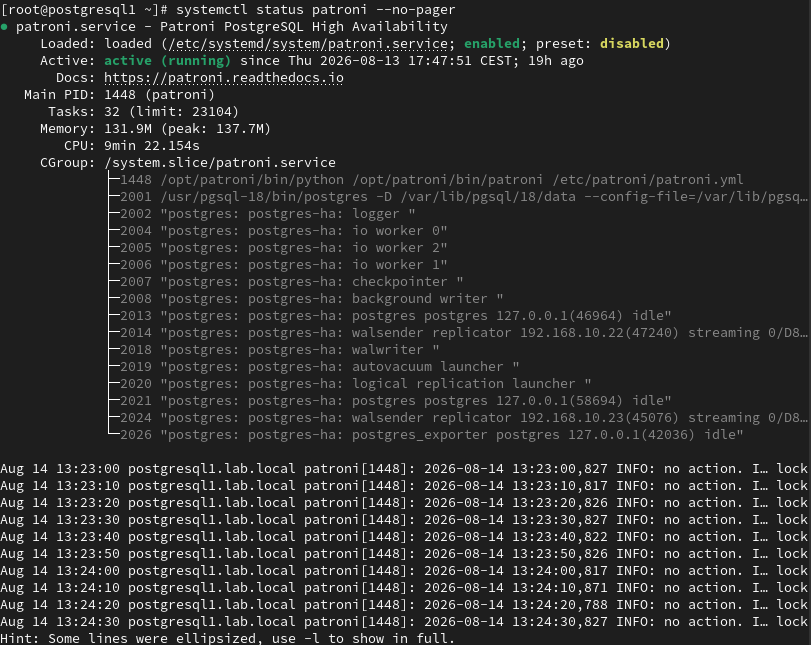

Verificar el clúster

En postgresql1:

- /opt/patroni/bin/patronictl -c /etc/patroni/patroni.yml list

Debe aparecer postgresql1 como:

- Role: Leader
- State: running

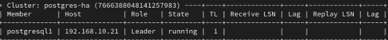

Comprobar la API:

- curl -s http://192.168.10.21:8008/primary

Incorporar las réplicas

Ahora arranca Patroni en worker2 y después en worker3:

- systemctl enable --now patroni

- systemctl status patroni --no-pager

Patroni detectará el primario y clonará automáticamente PostgreSQL mediante pg_basebackup.

Después, desde postgresql1, comprueba:

- opt/patroni/bin/patronictl -c /etc/patroni/patroni.yml list

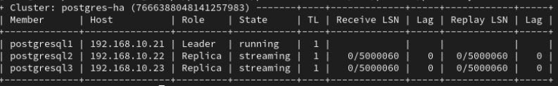

## 5. Modificar 'pg_hba.conf' después de crear el clúster

En clúster gestionado por Patroni, no configurar directamente “/var/lib/pgsql/18/data/pg_hba.conf” del PostgreSQL tradicional. Patroni es quien genera y administra ese fichero. Por eso editarlo manualmente no es recomendable: el cambio puede funcionar temporalmente, pero Patroni puede sobrescribirlo posteriormente y además tendrías que repetirlo manualmente en los tres nodos.

Con Patroni modificas la configuración dinámica centralizada en etcd. Patroni conoce esas reglas y las aplica de forma coherente al clúster.

etcd es la una única fuente de verdad y evitas que postgresql1, postgresql2 y postgresql3 terminen con reglas distintas.

Modificar

Una vez que el clúster Patroni ha sido inicializado, las reglas definidas dentro del bloque “bootstrap” se utiliza únicamente durante la creación inicial del clúster.

- vi /etc/patroni/patroni.yml

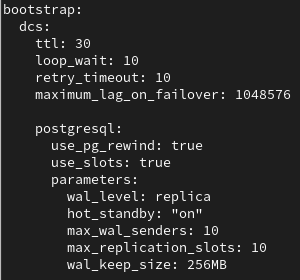

A partir de ese momento, las modificaciones de “pg_hba.conf” deben realizarse mediante la configuración dinámica de Patroni almacenada en etcd:

- /opt/patroni/bin/patronictl -c /etc/patroni/patroni.yml edit-config

Esto permite modificar la configuración de forma centralizada para que Patroni la gestione y aplique de manera coherente en los nodos del clúster.

Reglas necesarias para nuestro laboratorio

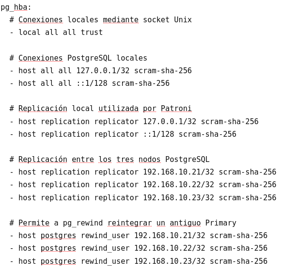

¿Por qué añadimos estas reglas? Las reglas de “replicator” permiten que las réplicas reciban los WAL del Primary y que Patroni pueda realizar las comprobaciones de replicación necesarias, incluyendo las conexiones locales por “127.0.0.1”

Las reglas de “rewind_user” son necesarias para “pg_rewind”. Después de un failover, el antiguo Primary puede quedar en un timeline anterior. Patroni utiliza “pg_rewind” para sincronizarlo con el nuevo Primary y reintegrarlo como réplica sin tener que reconstruirlo completamente.

La ausencia de estas reglas impide que antiguo nodo primary pasara correctamente del timeline anterior al nuevo.

Aplicar los cambios

Después de guardar los cambios con “edit-config”:

- /opt/patroni/bin/patronictl -c /etc/patroni/patroni.yml reload postgres-ha

Comprobar:

- /opt/patroni/bin/patronictl -c /etc/patroni/patroni.yml list

El estado normal esperado es un único Leader y las otras dos instancias como Replica en streaming todas siguiendo el timeline actual.

## 6. Instalar HAProxy

Instalar HAProxy

En HAProxy-1 y HAProxy-2:

- dnf install -y haproxy

- haproxy -v

Abrir puertos

En ambos nodos:

- firewall-cmd --permanent --add-port=5432/tcp

- firewall-cmd --permanent --add-port=7000/tcp

- firewall-cmd --reload

- 5432: acceso al PostgreSQL primario.
- 7000: página de estadísticas de HAProxy.

Crear la configuración

En ambos nodos HAproxy:

- cp /etc/haproxy/haproxy.cfg /etc/haproxy/haproxy.cfg.bak

Después sustituye el contenido:

```ini
cat > /etc/haproxy/haproxy.cfg <<'EOF'
# Configuración global de HAProxy.
global
# Envía los logs al servidor syslog local.
log 127.0.0.1 local2
# Aísla el proceso dentro de este directorio por seguridad.
chroot /var/lib/haproxy
# Archivo donde se almacena el PID del proceso.
pidfile /run/haproxy.pid
# Número máximo de conexiones simultáneas.
maxconn 4000
# Usuario y grupo con los que se ejecutará HAProxy.
user haproxy
group haproxy
# Ejecuta HAProxy en segundo plano.
daemon
# Configuración por defecto para todos los frontends y backends.
defaults
# Trabaja a nivel TCP (ideal para PostgreSQL).
mode tcp
# Usa la configuración global de logs.
log global
# Registra las conexiones TCP.
option tcplog
# No registra conexiones vacías.
option dontlognull
# Reintenta una conexión fallida hasta 3 veces.
retries 3
# Tiempo máximo para conectar con un servidor.
timeout connect 5s
# Tiempo máximo que puede permanecer abierta una conexión cliente.
timeout client 30m
# Tiempo máximo que puede permanecer abierta una conexión servidor.
timeout server 30m
# Tiempo máximo para realizar una comprobación de estado.
timeout check 5s
# Punto de entrada de las conexiones PostgreSQL.
frontend postgres_primary
# Escucha en el puerto 5432.
bind \*:5432
# Envía todas las conexiones al backend patroni_primary.
default_backend patroni_primary
# Backend formado por los tres servidores PostgreSQL.
backend patroni_primary
# Comprueba el estado de Patroni mediante la API REST.
option httpchk GET /primary
# Solo considera disponible un servidor si responde HTTP 200.
# El líder responde 200 y las réplicas responden 503.
http-check expect status 200
# Servidores PostgreSQL monitorizados por Patroni.
# El tráfico solo se enviará al que sea líder.
server postgresql1 192.168.10.21:5432 check port 8008
server postgresql2 192.168.10.22:5432 check port 8008
server postgresql3 192.168.10.23:5432 check port 8008
# Página web de estadísticas de HAProxy.
listen stats
# Disponible en el puerto 7000.
bind \*:7000
# Funciona mediante HTTP.
mode http
# Activa las estadísticas.
stats enable
# URL de acceso: http://IP:7000/
stats uri /
# Refresca la página cada 5 segundos.
stats refresh 5s
EOF
```

¿Qué hace esta configuración?

HAProxy actúa como punto de entrada al clúster PostgreSQL, escuchando las conexiones en el puerto 5432. Para saber qué nodo es el Primary, consulta periódicamente la API REST de Patroni (http://IP:8008/primary). Solo el nodo líder responde con HTTP 200, por lo que HAProxy dirige automáticamente las conexiones PostgreSQL únicamente hacia el Primary.

Además, expone una página de estadísticas en el puerto 7000 para consultar el estado de los servidores configurados.

En resumen: HAProxy permite que los clientes se conecten siempre al Primary actual sin necesidad de conocer qué servidor desempeña ese rol, incluso después de un failover.

Validar y arrancar

En ambos nodos HAProxy:

- haproxy -c -f /etc/haproxy/haproxy.cfg

Debe mostrar: Configuration file is valid

Después:

- systemctl enable --now haproxy

- systemctl status haproxy --no-pager

Comprueba desde uno de los HAProxy:

- curl -s <http://192.168.10.21:8008/primary>

- curl -s -o /dev/null -w "%{http_code}\n" [http://192.168.10.21:8008/primar](http://192.168.10.21:8008/primary)[y](http://192.168.10.21:8008/primary)

- curl -s -o /dev/null -w "%{http_code}\n" <http://192.168.10.22:8008/primary>

- curl -s -o /dev/null -w "%{http_code}\n" http://192.168.10.23:8008/primary

El líder debe devolver 200; las réplicas, normalmente 503.

## 7. Instalar Keepalived (VIP)

Hasta ahora los clientes se conectarían a HAproxy(192.168.10.30:5432). El problema es que, si HAProxy-1 falla, HAProxy-2 (192.168.10.31) seguiría funcionando, pero los clientes tendrían que cambiar manualmente la IP de conexión. Por tanto, todavía tendríamos un punto único de fallo.

Para solucionarlo utilizamos Keepalived, que proporciona una IP virtual flotante (VIP) compartida entre ambos HAProxy: VIP: 192.168.10.32

Keepalived mantiene la VIP normalmente en HAProxy-1. Si este nodo falla, la VIP pasa automáticamente a HAProxy-2. Los clientes siempre se conectan a: 192.168.10.32:5432

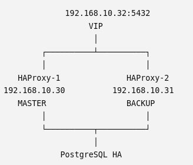

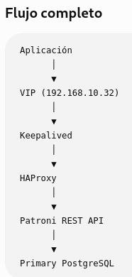

De esta forma, los clientes utilizan siempre la misma IP, independientemente de qué HAProxy esté activo.

Configuraremos Keepalived mediante VRRP en modo unicast, especialmente adecuado para entornos virtualizados donde el tráfico multicast puede estar limitado o no ser conveniente.

Instalar Keepalived

En nodos HAProxy-1 y HAProxy-2:

- dnf install -y keepalived

Crear el script de comprobación de HAProxy

En ambos nodos:

```bash
cat > /usr/local/bin/check_haproxy.sh <<'EOF'
#!/bin/bash
# Comprueba si el servicio HAProxy está activo.
# --quiet no muestra salida, solo devuelve un código:
# 0 -> HAProxy está activo.
# 3 -> HAProxy está detenido.
# Keepalived utiliza este código para decidir si mantiene
# o reduce la prioridad del nodo.
/usr/bin/systemctl is-active --quiet haproxy
-chmod 750 /usr/local/bin/check_haproxy.sh
Este script no hace más que comprobar si HAProxy está en ejecución. Si está activo, Keepalived mantiene la prioridad del nodo; si está parado, reduce la prioridad y permite que el otro servidor tome la VIP. Este script devuelve:
- éxito si HAProxy está funcionando;
- error si HAProxy está detenido.
Keepalived usará el resultado para decidir si ese nodo puede mantener la VIP.
Configurar keepalived en nodo HAProxy-1
- cp /etc/keepalived/keepalived.conf / etc/keepalived/keepalived.conf.bak
-Añadir:
cat > /etc/keepalived/keepalived.conf <<'EOF'
# Configuración global de Keepalived.
global_defs {
# Identificador único de este servidor.
# Indica que este archivo pertenece al primer nodo HAProxy.
router_id HAPROXY_1
# Activa controles de seguridad para los scripts externos.
enable_script_security
# Ejecuta los scripts de comprobación como usuario root.
script_user root
}
# Define la comprobación del estado de HAProxy.
vrrp_script check_haproxy {
# Script que comprueba si el servicio HAProxy está activo.
script "/usr/local/bin/check_haproxy.sh"
# Ejecuta la comprobación cada 2 segundos.
interval 2
# Si tarda más de 2 segundos, la comprobación se considera fallida.
timeout 2
# HAProxy se considera caído después de 2 fallos consecutivos.
fall 2
# HAProxy se considera recuperado después de 2 comprobaciones correctas.
rise 2
# Si el script falla, resta 30 puntos a la prioridad del nodo.
# La prioridad pasaría de 110 a 80.
weight -30
}
# Define la instancia VRRP encargada de gestionar la VIP de PostgreSQL.
vrrp_instance VI_POSTGRES {
# Este nodo parte como MASTER y normalmente tendrá la VIP.
state MASTER
# Interfaz de red por la que se comunican los nodos
# y en la que se asignará la VIP.
interface enp1s0
# Identificador del grupo VRRP.
# Debe ser exactamente el mismo en HAProxy-1 y HAProxy-2.
virtual_router_id 51
# Prioridad de este nodo.
# Como HAProxy-1 tiene 110 y HAProxy-2 tiene 100,
# HAProxy-1 será normalmente el nodo activo.
priority 110
# Envía anuncios VRRP cada segundo.
advert_int 1
# IP real de este servidor HAProxy-1.
# Se utiliza como origen de los mensajes VRRP unicast.
unicast_src_ip 192.168.10.30
# IP real del otro servidor Keepalived.
unicast_peer {
192.168.10.31
}
# Autenticación básica entre los dos nodos VRRP.
authentication {
# Usa autenticación mediante contraseña.
auth_type PASS
# Contraseña compartida entre HAProxy-1 y HAProxy-2.
# Debe coincidir en ambos nodos.
auth_pass pgvip123
}
# Dirección IP virtual que se moverá entre los dos HAProxy.
virtual_ipaddress {
# VIP utilizada por las aplicaciones para conectarse a PostgreSQL.
192.168.10.32/24 dev enp1s0
}
# Relaciona el estado de HAProxy con la prioridad VRRP.
track_script {
# Si esta comprobación falla, se aplica weight -30.
check_haproxy
}
}
# Fin del contenido escrito en el archivo.
EOF
```

En condiciones normales, HAProxy-1 mantiene la VIP porque tiene prioridad 110. Si HAProxy-1 falla, baja a 80, mientras HAProxy-2 mantiene 100 y toma la VIP 192.168.10.32.

Configurar keepalived en nodo HAProxy-2

- cp /etc/keepalived/keepalived.conf /etc/keepalived/keepalived.conf.bak

-Añadir:

```ini
cat > /etc/keepalived/keepalived.conf <<'EOF'
# Configuración global de Keepalived.
global_defs {
# Identificador único de este nodo.
# En este caso representa al segundo servidor HAProxy.
router_id HAPROXY_2
# Obliga a Keepalived a aplicar controles de seguridad
# sobre los scripts que ejecuta.
enable_script_security
# Indica que los scripts serán ejecutados como usuario root.
script_user root
}
# Define un script de comprobación de salud.
vrrp_script check_haproxy {
# Script que verifica si HAProxy está activo.
script "/usr/local/bin/check_haproxy.sh"
# Ejecuta el script cada 2 segundos.
interval 2
# Si el script tarda más de 2 segundos, se considera fallo.
timeout 2
# Necesita 2 fallos consecutivos para considerar HAProxy caído.
fall 2
# Necesita 2 comprobaciones correctas consecutivas para considerarlo recuperado.
rise 2
# Si el script falla, reduce la prioridad de este nodo en 30 puntos.
weight -30
}
# Define la instancia VRRP que controla la IP virtual.
vrrp_instance VI_POSTGRES {
# Este nodo empieza como BACKUP.
# Solo tendrá la VIP si el nodo MASTER falla.
state BACKUP
# Interfaz de red por la que funcionará VRRP y se asignará la VIP.
interface enp1s0
# Identificador común del grupo VRRP.
# Debe ser igual en HAProxy-1 y HAProxy-2.
virtual_router_id 51
# Prioridad de este nodo.
# Como tiene 100 y HAProxy-1 tiene 110, normalmente será BACKUP.
priority 100
# Envía anuncios VRRP cada 1 segundo.
advert_int 1
# IP real de este servidor HAProxy-2.
# Se usa porque VRRP está configurado en modo unicast.
unicast_src_ip 192.168.10.31
# IP del otro nodo participante en VRRP.
unicast_peer {
192.168.10.30
}
# Autenticación básica entre los nodos VRRP.
authentication {
# Tipo de autenticación por contraseña.
auth_type PASS
# Contraseña compartida.
# Debe ser igual en ambos nodos.
auth_pass pgvip123
}
# IP virtual que se moverá entre HAProxy-1 y HAProxy-2.
virtual_ipaddress {
# VIP del servicio PostgreSQL.
# Se asignará a la interfaz enp1s0 del nodo activo.
192.168.10.32/24 dev enp1s0
}
# Asocia la salud de HAProxy con la prioridad VRRP.
track_script {
# Si este script falla, se aplicará el weight -30.
check_haproxy
}
}
# Fin del bloque que se escribe en el archivo.
EOF
```

En resumen, este archivo configura HAProxy-2 como BACKUP. Si HAProxy-1 deja de estar disponible o su HAProxy falla, HAProxy-2 aumenta su posición relativa y toma la VIP 192.168.10.32

Abrir VRRP en el firewall

En ambos nodos:

- firewall-cmd --permanent --add-rich-rule='rule protocol value="vrrp" accept'

- firewall-cmd --reload

Esto permite que Keepalived intercambie mensajes VRRP entre HAProxy-1 y HAProxy-2, necesarios para decidir qué nodo mantiene la VIP

VRRP utiliza el protocolo IP 112; no utiliza un puerto TCP o UDP.

Validar la configuración

En ambos nodos:

- keepalived --config-test

Si no muestra errores importantes, continúa.

Arrancar Keepalived

Primero en HAProxy-2 y después en HAProxy-1:

- systemctl enable --now keepalived

Se recomienda arrancar primero HAProxy-2 (BACKUP) y después HAProxy-1 (MASTER) para que la transición inicial de VRRP sea ordenada.

1. HAProxy-2 arranca → al no detectar MASTER, puede asumir temporalmente la VIP.
2. HAProxy-1 arranca → tiene mayor prioridad, por lo que pasa a MASTER y toma la VIP.
3. HAProxy-2 → queda como BACKUP.

Así puedes comprobar desde el principio que ambos nodos participan correctamente en VRRP y que la VIP puede moverse entre ellos.

Comprobar dónde está la VIP

En HAProxy-1:

- ip -br addr show enp1s0

Debería aparecer: enp1s0 UP 192.168.10.30/24 192.168.10.32/24

En HAProxy-2 solo debería aparecer: 192.168.10.31/24

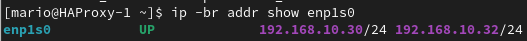

La VIP queda inicialmente en HAProxy-1 porque tiene prioridad 110, superior a la prioridad 100 de HAProxy-2

Comprobar failover

Keepalived funciona correctamente:

- HAProxy-1 tiene su IP real 192.168.10.30 y la VIP 192.168.10.32.

- HAProxy-2 solo tiene su IP real 192.168.10.31.

Por tanto, HAProxy-1 está como MASTER y HAProxy-2 como BACKUP.

---

VRRP Multicast (modo tradicional)

Es el modo original de VRRP. Los nodos envían anuncios multicast para avisar de que siguen vivos.

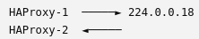

Ventajas

- Configuración muy sencilla.
- Es el estándar de VRRP.
- Muy utilizado en redes físicas tradicionales.

Inconvenientes

Muchas plataformas virtuales bloquean o no gestionan bien el tráfico multicast, por ejemplo:

- VMware (según configuración) y VirtualBox.
- Algunas redes cloud.
- Algunas VLAN o switches.

Esto puede provocar que los nodos no se vean entre sí y ambos crean que son el MASTER (split-brain).

VRRP Unicast

En lugar de enviar multicast, los nodos se envían mensajes directamente entre ellos.

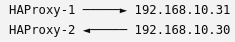

No depende de que la red soporte multicast.

Ventajas

- Funciona en prácticamente cualquier red.
- Ideal para máquinas virtuales.
- Ideal para cloud (AWS, Azure, GCP...).
- Más predecible.

Inconveniente

- Hay que indicar manualmente quiénes son los nodos vecinos (unicast_peer)

¿Es unicast incorrecto en físico? No. Unicast también es totalmente válido en servidores físicos. Simplemente configuras explícitamente las IP de los dos nodos. Es más predecible y facilita saber exactamente entre qué servidores circulan los anuncios

---

Detener servicio haproxy en HAProxy-1

- systemctl stop haproxy

El script de Keepalived detectará el fallo y reducirá la prioridad del nodo.

Espera unos segundos y comprueba:

- ip -br addr show enp1s0

- En HAProxy-1 debería desaparecer: 192.168.10.32/24
- En HAProxy-2 debería aparecer: 192.168.10.31/24 192.168.10.32/24

Recuperar servicio haproxy en HAProxy-1

- systemctl start haproxy

Tras unos segundos, como HAProxy-1 tiene prioridad 110 y HAProxy-2 prioridad 100, la VIP debería volver automáticamente a HAProxy-1.

## 8. Validar la alta disponibilidad completa

Caída del PostgreSQL líder

Primero comprueba cuál es el líder actual desde cualquiera de los nodos PostgreSQL:

- /opt/patroni/bin/patronictl -c /etc/patroni/patroni.yml list

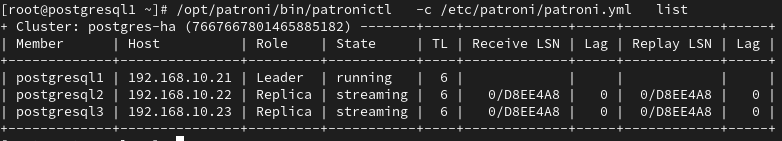

En postgresql1, detén Patroni:

- systemctl stop patroni

Espera unos segundos y vuelve a comprobar desde otro nodo:

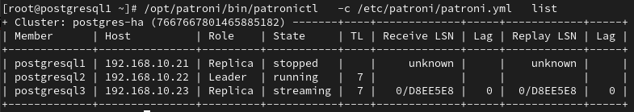

Patroni debe promover automáticamente una réplica a leader

Cuando detienes Patroni en postgresql1 ocurren dos cosas:

1. Se detiene PostgreSQL.
2. Patroni elimina ese nodo del clúster porque ya no puede enviar su heartbeat al DCS (etcd).

Por eso desaparece de la lista. No aparece como stopped, simplemente deja de formar parte del clúster activo.

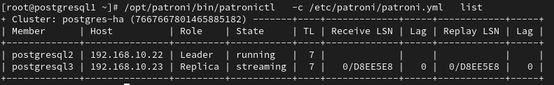

Ahora recupera postgresql1

En postgresql1:

- systemctl start patroni

Esto es precisamente una de las ventajas de Patroni. Con PostgreSQL manualmente tendrías que:

1. Averiguar quién es el nuevo líder,
2. Ejecutar pg_rewind o pg_basebackup,
3. Reconfigurar la replicación,
4. Arrancar PostgreSQL.

Con Patroni, todo eso lo hace automáticamente.

¿Qué significa TL = Timeline?

Cada vez que Patroni promueve una réplica a líder, PostgreSQL crea una nueva timeline para evitar que el antiguo líder siga escribiendo sobre el mismo historial.

En tu caso ocurrió esto:

1. postgresql1 era el líder → Timeline 6
2. Lo detuviste.
3. postgresql2 fue promovido → Timeline 7
4. postgresql1 volvió como réplica y ahora debe sincronizarse con la nueva timeline.

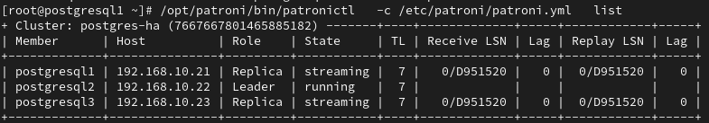

Validar la conexión real mediante la VIP

Desde cualquier nodo con psql:

- psql -h 192.168.10.32 -p 5432 -U postgres -d postgres

Dentro de PostgreSQL:

- SELECT inet_server_addr(), pg_is_in_recovery();

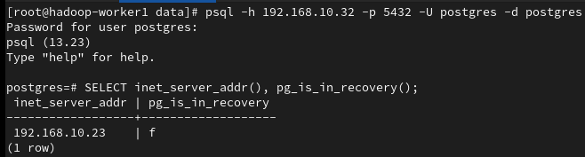

Esto confirmará que:

- la conexión entra por la VIP;
- Keepalived dirige la VIP al HAProxy activo;
- HAProxy envía la conexión al líder actual;
- PostgreSQL responde desde el primario, no desde una réplica.

Crear una tabla temporal

Desde postgresql1:

- psql -h 192.168.10.32 -p 5432 -U postgres -d postgres

- CREATE TABLE prueba_ha (

id serial PRIMARY KEY,

mensaje text,

fecha timestamp DEFAULT now()

);

INSERT INTO prueba_ha (mensaje)

VALUES ('Prueba HA correcta');

SELECT \* FROM prueba_ha;

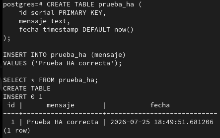

Aunque psql se ejecutó en postgresql1, la conexión fue a la VIP (192.168.10.32). HAProxy-1 redirigió la conexión al líder (postgresql2 - 192.168.10.22). La tabla se creó en el servidor líder (postgresql2). La replicación la copió automáticamente a postgresql1 y postgresql3.

La escritura a través de la VIP funciona correctamente. Ahora comprobamos que el dato se ha replicado en las dos réplicas

En postgresql1 y postgresql3

- sudo -u postgres psql -d postgres

Y ejecuta:

- SELECT inet_server_addr(), pg_is_in_recovery();

- SELECT \* FROM prueba_ha;

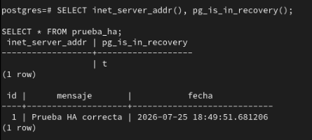

Esa prueba confirma que la replicación funciona correctamente.

La salida indica: pg_is_in_recovery = t (t (true) → es una réplica solo lectura).

La tabla prueba_ha existe con el mismo contenido que en el líder. Eso demuestra que la escritura realizada en el líder se ha replicado automáticamente a replicas

## 9. Servicios externos

Los servicios de que usen PostgreSQL externo deben apuntar a la VIP, no a la IP de un nodo concreto.

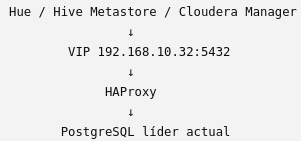

Así, si cambia el líder, no tienes que modificar la configuración de estos servicios.

