# Prometheus + Grafana con PostgreSQL HA


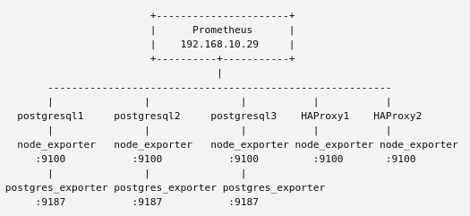


¿Qué monitorizarías?

- PostgreSQL: disponibilidad, conexiones, consultas, CPU, memoria y replicación.
- Patroni: líder actual, estado de las réplicas, cambios de rol y failovers.
- HAProxy: disponibilidad, conexiones, backend activo y estado de los nodos PostgreSQL.
- Keepalived: estado y ubicación de la VIP.
- Sistema operativo: CPU, RAM, disco, red y carga de los servidores.

### Arquitectura de monitorización

- Nodo monitoring (192.168.10.29):

  - Prometheus: recopila y almacena las métricas.
  - Grafana: visualiza las métricas mediante dashboards.
  - Alertmanager: gestiona y envía las alertas.

- Nodos postgresql1, postgresql2 y postgresql3:

  - node_exporter: métricas del sistema operativo.
  - postgres_exporter: métricas de PostgreSQL.
  - API REST de Patroni: estado del clúster y roles.

- Nodos HAProxy-1 y HAProxy-2:

  - node_exporter: métricas del sistema operativo.
  - Métricas de HAProxy: frontend, backends, sesiones y estado de los nodos.

### Flujo


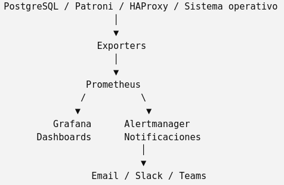


## 1. Instalar Prometheus

### Crear el usuario de Prometheus

- useradd --no-create-home --shell /sbin/nologin prometheus

- id prometheus

- 

### Crear directorios y asigrnar permisos

- mkdir /etc/prometheus

- mkdir /var/lib/prometheus

- chown prometheus:prometheus /etc/prometheu

- chown prometheus:prometheus /var/lib/prometheus

- ls -ld /etc/prometheus /var/lib/prometheus

### Descargar Prometheus

Al ser Rocky 9.8, mi recomendación es instalar Prometheus desde el binario oficial. Es la forma más utilizada en entornos empresariales porque controlas la versión y no dependes de los repositorios de la distribución.

Vamos a usar una versión estable (la 3.x también sería válida, pero la 2.55.x sigue siendo muy común en producción).

- cd /tmp

- curl -LO https://github.com/prometheus/prometheus/releases/download/v2.55.1/prometheus-2.55.1.linux-amd64.tar.gz

- tar -xzf prometheus-2.55.1.linux-amd64.tar.gz

- ls -l /tmp/prometheus-2.55.1.linux-amd64

### Copiar los binarios

- cp /tmp/prometheus-2.55.1.linux-amd64/prometheus /usr/local/bin/

- cp /tmp/prometheus-2.55.1.linux-amd64/promtool /usr/local/bin/

- chown prometheus:prometheus /usr/local/bin/prometheus

- chown prometheus:prometheus /usr/local/bin/promtool

- ls -l /usr/local/bin/prometheus /usr/local/bin/promtool

¿Por qué copiamos estos dos archivos?

- prometheus → Es el servidor que recoge las métricas.
- promtool → Herramienta para validar configuraciones y realizar pruebas.

### Copiar la configuración y las consolas

- cp -r /tmp/prometheus-2.55.1.linux-amd64/consoles /etc/prometheus/

- cp -r /tmp/prometheus-2.55.1.linux-amd64/console_libraries /etc/prometheus/

- cp /tmp/prometheus-2.55.1.linux-amd64/prometheus.yml /etc/prometheus/

- chown -R prometheus:prometheus /etc/prometheus

- ls -l /etc/prometheus

¿Por qué copiamos estos archivos?

- prometheus.yml → Archivo principal de configuración. Aquí se define qué servidores y métricas va a monitorizar Prometheus.
- consoles/ → Consolas web predefinidas de Prometheus.
- console_libraries/ → Librerías utilizadas por esas consolas.

### Crear el servicio systemd

- vi /etc/systemd/system/prometheus.service
```ini
[Unit]
# Nombre y descripción del servicio
Description=Prometheus Monitoring
# Documentación oficial
Documentation=https://prometheus.io/docs/introduction/overview/
# Iniciar Prometheus después de que la red esté disponible
After=network.target
[Service]
# Usuario y grupo con los que se ejecutará Prometheus
User=prometheus
Group=prometheus
# Prometheus se ejecuta como proceso principal
Type=simple
# Ejecutable de Prometheus y parámetros de arranque
ExecStart=/usr/local/bin/prometheus \\
# Archivo principal de configuración
--config.file=/etc/prometheus/prometheus.yml \\
# Directorio donde se almacenan las métricas
--storage.tsdb.path=/var/lib/prometheus \\
# Plantillas de la consola web
--web.console.templates=/etc/prometheus/consoles \\
# Librerías utilizadas por las consolas
--web.console.libraries=/etc/prometheus/console_libraries
# Reiniciar automáticamente si Prometheus falla
Restart=on-failure
[Install]
# Permite iniciar Prometheus automáticamente durante el arranque
WantedBy=multi-user.target
```

### Arranca

- systemctl daemon-reload

- systemctl enable prometheus

- systemctl start prometheus

- systemctl status prometheus

### Comprobamos

- ss -lntp | grep 9090

- curl http://localhost:9090/-/ready


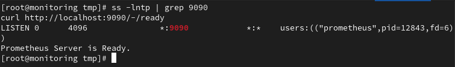


Después abre en el navegador:

- http://192.168.10.29:9090

Si no accede desde fuera, abre el puerto

- firewall-cmd --permanent --add-port=9090/tcp

- firewall-cmd --reload


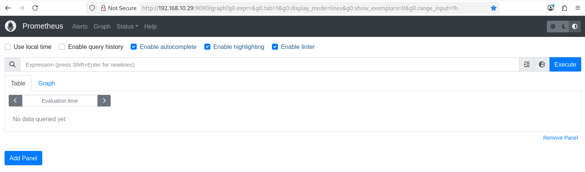


## 2. Instalar Grafana

Seguimos con Grafana en el nodo monitoring (192.168.10.29). Lo instalaremos usando el repositorio oficial, para facilitar futuras actualizaciones. Grafana admite instalación mediante repositorio RPM en sistemas RHEL/Fedora.

### Configurar el repositorio

En nodo monitoring:

- vi /etc/yum.repos.d/grafana.repo
```ini
# Repositorio oficial de Grafana
[grafana]
# Nombre identificativo del repositorio
name=Grafana
# URL del repositorio RPM
baseurl=https://rpm.grafana.com
# Verificar la firma del propio repositorio
repo_gpgcheck=1
# Habilitar el repositorio
enabled=1
# Verificar la firma GPG de los paquetes descargados
gpgcheck=1
# Clave pública GPG utilizada para validar los paquetes
gpgkey=https://rpm.grafana.com/gpg.key
# Verificar el certificado SSL del repositorio
sslverify=1
# Certificados de confianza utilizados para la conexión HTTPS
sslcacert=/etc/pki/tls/certs/ca-bundle.crt
```

Comprueba que el repositorio responde:

- dnf repolist | grep -i grafana


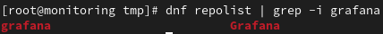


### Instalar Grafana OSS

- dnf install -y grafana

- grafana server -v


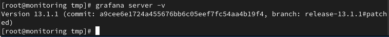


### Iniciar el servicio

- systemctl daemon-reload

- systemctl enable --now grafana-server

- systemctl status grafana-server


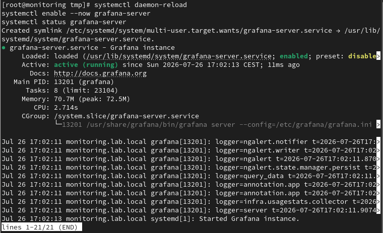


Grafana se gestiona como servicio systemd en este tipo de instalación.

### Comprobar el puerto 3000

- ss -lntp | grep 3000


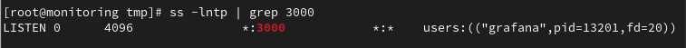


### Abrir el firewall

- firewall-cmd --add-port=3000/tcp --permanent

- firewall-cmd --reload

- firewall-cmd --list-ports

Después abre:

- http://192.168.10.29:3000

Las credenciales iniciales habituales son:

- Usuario: admin
- Contraseña: admin

⚠️ Grafana pedirá cambiar esta contraseña en el primer login. Hazlo — son las credenciales por defecto conocidas públicamente, nunca dejarlas así en un entorno accesible.

### Añadir Prometheus como Data Source

- 1. En el menú izquierdo: Connections → Data sources

- 2. Pulsa: Add new data source

- 3. Selecciona: Prometheus

- 4. Configuración

    - En Connection:

- - - Name: Prometheus
    - Prometheus server URL: [http://localhost:9090](http://localhost:9090/)
    - Pulsa: Save & Test

Como Prometheus está instalado en el mismo servidor que Grafana, localhost es lo correcto. No cambies nada más.


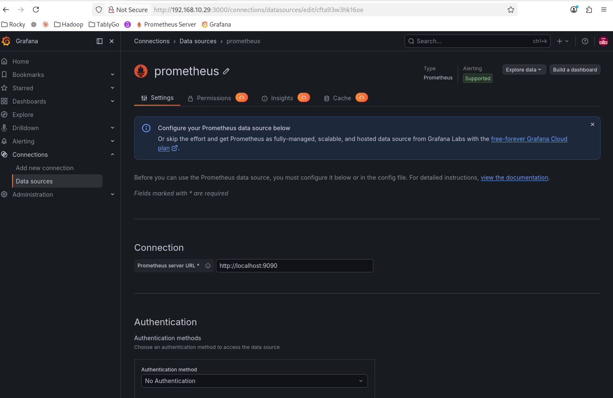


## 3. Monitorizar nodos

### Instalar node_exporter

¿Qué es node_exporter?

Es un pequeño servicio que expone métricas del sistema operativo para que Prometheus las recoja (CPU, Memoria, Disco, Red, Sistema de archivos, Carga del sistema, etc.)

Lo instalaremos en nodos:

- postgresql1
- postgresql2
- postgresql3
- HAProxy-1
- HAProxy-2

No hace falta instalarlo en nodo monitoring, porque Prometheus ya monitoriza su propio estado.

### Crear usuario node_exporter en 5 nodos

- useradd --no-create-home --shell /sbin/nologin node_exporter

- id node_exporter

### Descargar node_exporter en 5 nodos

- cd /tmp

- curl -LO <https://github.com/prometheus/node_exporter/releases/download/v1.9.1/node_exporter-1.9.1.linux-amd64.tar.gz>

- tar -xzf node_exporter-1.9.1.linux-amd64.tar.gz

### Instalar node_exporter en 5 nodos

- cp /tmp/node_exporter-1.9.1.linux-amd64/node_exporter /usr/local/bin

- chown node_exporter:node_exporter /usr/local/bin/node_exporter

- ls -l /usr/local/bin/node_exporter

### Crear el servicio

- vi /etc/systemd/system/node_exporter.service
```ini
[Unit]
# Nombre y descripción del servicio
Description=Prometheus Node Exporter
# Documentación oficial
Documentation=https://prometheus.io/docs/guides/node-exporter/
# Iniciar después de que la red esté disponible
After=network.target
[Service]
# Usuario y grupo con los que se ejecutará Node Exporter
User=node_exporter
Group=node_exporter
# Se ejecuta como proceso principal
Type=simple
# Ejecutable de Node Exporter
# Expone las métricas del sistema por defecto en el puerto 9100
ExecStart=/usr/local/bin/node_exporter
# Reiniciar automáticamente si el proceso falla
Restart=on-failure
[Install]
# Iniciar automáticamente con el sistema
WantedBy=multi-user.target
```

### Arranca

- systemctl daemon-reload

- systemctl enable node_exporter

- systemctl start node_exporter

Comprueba:

- systemctl status node_exporter

- ss -lntp | grep 9100


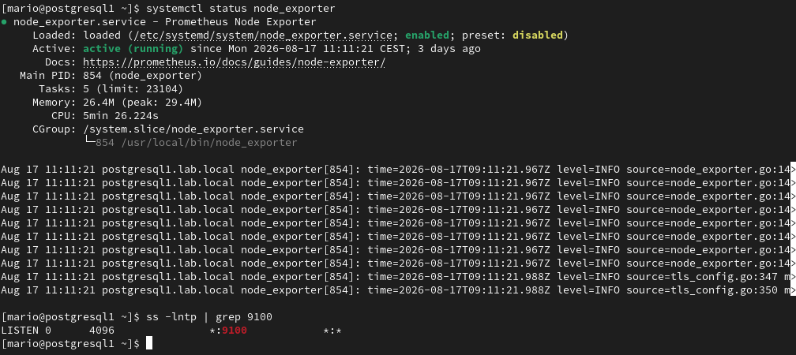


### Probar las métricas

- curl -s http://localhost:9100/metrics | head


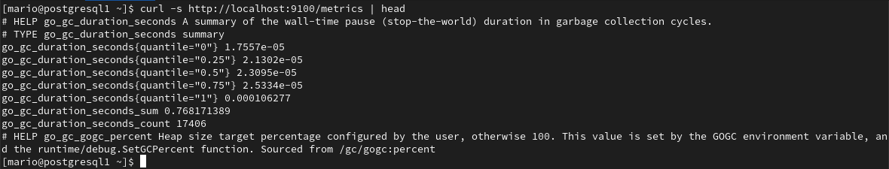


### Añadir nodos a Prometheus

En nodo monitoring:

- vi /etc/prometheus/prometheus.yml
```yaml
Déjalo así:
# Configuración global de Prometheus
global:
# Frecuencia con la que Prometheus recopila métricas
scrape_interval: 15s
# Frecuencia con la que evalúa las reglas y alertas
evaluation_interval: 15s
# Servicios de los que Prometheus recopilará métricas
scrape_configs:
# Monitorización del propio Prometheus
```

 - job_name: "prometheus"

static_configs:

 - targets:

 - "localhost:9090"

# Métricas del sistema operativo mediante Node Exporter

 - job_name: "node_exporter"

static_configs:

 - targets:

# Servidores PostgreSQL

 - "192.168.10.21:9100" # postgresql1

 - "192.168.10.22:9100" # postgresql2

 - "192.168.10.23:9100" # postgresql3

# Servidores HAProxy

 - "192.168.10.30:9100" # HAProxy-1

 - "192.168.10.31:9100" # HAProxy-2

Comprueba la configuración:

- promtool check config /etc/prometheus/prometheus.yml


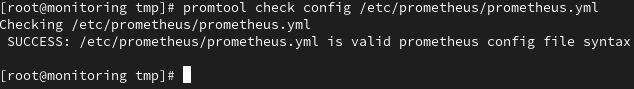


Reinicia Prometheus:

- systemctl restart prometheus

- systemctl status prometheus


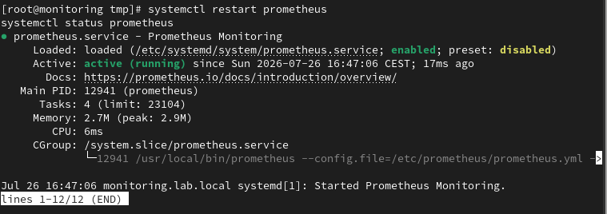


Después abre:

[](http://192.168.10.29:9090/targets)

- <http://192.168.10.29:9090/targets>


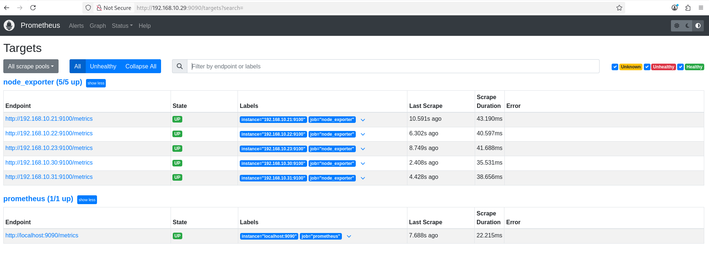


Si algún destino aparece DOWN, comprueba primero el firewall del nodo:

- firewall-cmd --add-port=9100/tcp --permanent

- firewall-cmd --reload

### Importar un Dashboard de node_exporter en Grafana

No vamos a crear gráficos manualmente. En producción se utilizan dashboards ya creados.

- 1. Ve a: Dashboards → New → Import
- 2. En Dashboard ID introduce: 1860

- - Es el dashboard oficial más utilizado para node_exporter.

- 1. Pulsa: Load


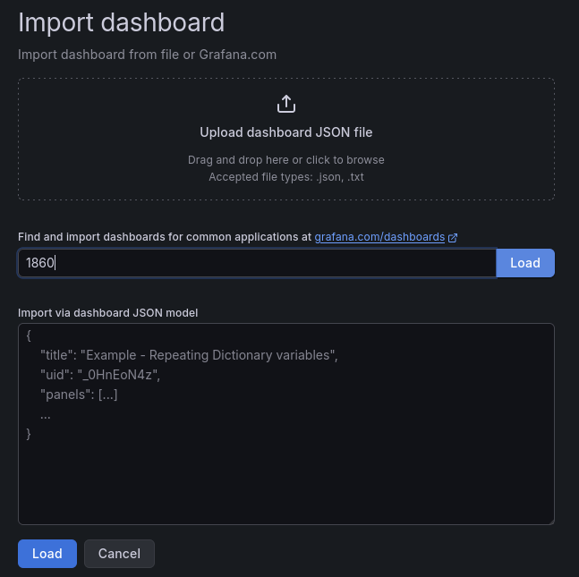


En la siguiente pantalla Grafana detectará la fuente de datos.


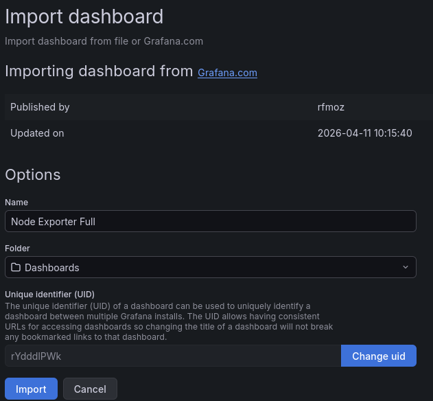


Pulsa directamente Import. (en muchas versiones de Grafana, al estar la fuente Prometheus como default, la asigna automáticamente)

Verás un panel muy completo con:

- CPU, Memoria y Swap
- Disco
- Red
- Filesystems
- Load Average
- Temperaturas (si existen)
- Procesos
- Context Switches
- Interrupts
- Uso por nodo

Es el dashboard que utilizan muchísimos administradores de sistemas

## 4. Monitorizar PostgreSQL

### Instalar PostgreSQL Exporter

El siguiente paso es monitorizar PostgreSQL. PostgreSQL Exporter, que es uno de los componentes más importantes para monitorizar una base de datos en producción.

¿Qué es postgres_exporter? Mientras node_exporter monitoriza el servidor, postgres_exporter monitoriza PostgreSQL.

Obtendremos métricas como:

- Conexiones activas.
- Transacciones por segundo.
- Replication Lag.
- Estado de las réplicas.
- WAL.
- Checkpoints.
- Locks.
- Deadlocks.
- Cache Hit Ratio.
- Tamaño de las bases de datos.

¿Dónde instalarlo? Lo instalaremos en cada nodo PostgreSQL (postgresql1, postgresql y postgresql3)

### Crear un usuario de monitorización

Conéctate al líder actual (el nodo que Patroni tenga como Primary).

- /opt/patroni/bin/patronictl -c /etc/patroni/patroni.yml list

En el nodo líder entra en PostgreSQL:

- sudo -u postgres /usr/pgsql-18/bin/psql

- CREATE USER postgres_exporter WITH PASSWORD '<EXPORTER_PASSWORD>';

- GRANT pg_monitor TO postgres_exporter; → concede permisos de monitorización:

- \du


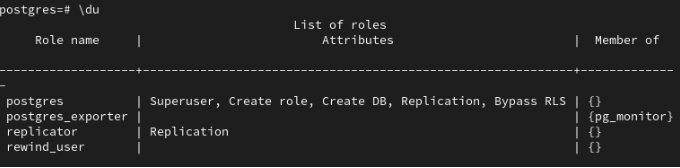


Perfecto: el usuario postgres_exporter está bien creado y pertenece a pg_monitor.

¿Por qué usamos pg_monitor? Porque permite leer estadísticas internas de PostgreSQL sin otorgar privilegios de administración, siguiendo el principio de mínimo privilegio.

############################# Acceso directo a psql####################################

### En todos los nodos PostgreSQL

Crear un enlace simbólico:

- sudo ln -s /usr/pgsql-18/bin/psql /usr/bin/psql

Ahora se puede acceder directamente:

- sudo -u postgres psql

Resultado: psql queda disponible desde una ruta estándar del sistema.

##################################################################################

Ahora instalamos el exporter en postgresql1, postgresql2 y postgresql3. Usaremos conexión local en cada nodo, así cada exporter consulta su PostgreSQL local, sea líder o réplica.

### Instalar PostgreSQL Exporter primero en postgresql1

Crea el usuario del sistema:

- useradd --no-create-home --shell /sbin/nologin postgres_exporter

Descarga e instala la versión 0.20.1:

- cd /tmp

- curl -LO <https://github.com/prometheus-community/postgres_exporter/releases/download/v0.20.1/postgres_exporter-0.20.1.linux-amd64.tar.gz>

- tar -xzf postgres_exporter-0.20.1.linux-amd64.tar.gz

- cp postgres_exporter-0.20.1.linux-amd64/postgres_exporter /usr/local/bin/

- chown postgres_exporter:postgres_exporter /usr/local/bin/postgres_exporter

- chmod 755 /usr/local/bin/postgres_exporter

Comprueba:

- /usr/local/bin/postgres_exporter --version

La versión 0.20.1 es la publicación más reciente disponible del proyecto oficial.

### Guardar las credenciales

No pondremos la contraseña directamente dentro del servicio.

- mkdir -p /etc/postgres_exporter

- vi /etc/postgres_exporter/postgres_exporter.env
```bash
Contenido:
```

- DATA_SOURCE_NAME=postgresql://postgres_exporter:<EXPORTER_PASSWORD_URLENCODED>@127.0.0.1:5432/postgres?sslmode=disable

El carácter ! de la contraseña está codificado como %21 dentro de la URL.

Protege el fichero:

- chown root:postgres_exporter /etc/postgres_exporter/postgres_exporter.env

- chmod 640 /etc/postgres_exporter/postgres_exporter.env

El exporter oficial utiliza una cadena de conexión mediante DATA_SOURCE_NAME

### Crear el servicio systemd

- vi /etc/systemd/system/postgres_exporter.service
```ini
[Unit]
Description=Prometheus PostgreSQL Exporter
After=network.target postgresql.service
Wants=network.target
[Service]
Type=simple
User=postgres_exporter
Group=postgres_exporter
EnvironmentFile=/etc/postgres_exporter/postgres_exporter.env
ExecStart=/usr/local/bin/postgres_exporter --web.listen-address=:9187
Restart=on-failure
RestartSec=5
[Install]
WantedBy=multi-user.target
```

*En Patroni puede que no exista un servicio llamado postgresql.service, pero no impide que el exporter arranque porque After= solo establece orden cuando ambos servicios existen.*

### Arrancar y validar

- systemctl daemon-reload

- systemctl enable --now postgres_exporter

- systemctl status postgres_exporter

Comprueba el puerto:

- ss -lntp | grep 9187

Prueba las métricas:

- curl -s http://localhost:9187/metrics | head


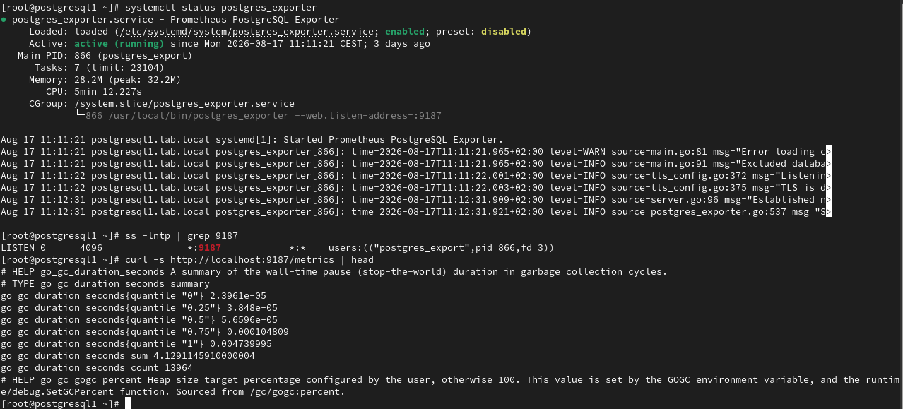


Después repetiremos exactamente lo mismo en postgresql2 y postgresql3.

*No necesitas volver a crear el usuario `postgres_exporter` en PostgreSQL, porque ese rol ya existe y está replicado en todo el clúster.*

Añade los tres postgres_exporter a Prometheus.

En el nodo monitoring:

- vi /etc/prometheus/prometheus.yml
```yaml
Debajo del bloque de node_exporter, añade:
# Métricas internas de PostgreSQL mediante postgres_exporter
```

- job_name: "postgres_exporter"

static_configs:

 - targets:

 - "192.168.10.21:9187" # postgresql1

 - "192.168.10.22:9187" # postgresql2

 - "192.168.10.23:9187" # postgresql3

Valida y reinicia:

- promtool check config /etc/prometheus/prometheus.yml

- systemctl restart prometheus

- systemctl status prometheus

Después abre:

- http://192.168.10.29:9090/targets

Debes ver los tres destinos de postgres_exporter en estado UP.


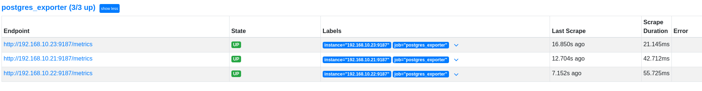


### Importar un Dashboard de postgres_exporter* *en Grafana

### Ahora vamos a visualizar PostgreSQL en Grafana

- 1. En Grafana: Dashboards → New → Import
- 2. Introduce el ID: 9628
- 3. Pulsa Load.

Este dashboard está diseñado para postgres_exporter y muestra las métricas principales de PostgreSQL.

Seleccionar la fuente de datos:

- Elige prometheus


- Pulsa Import.


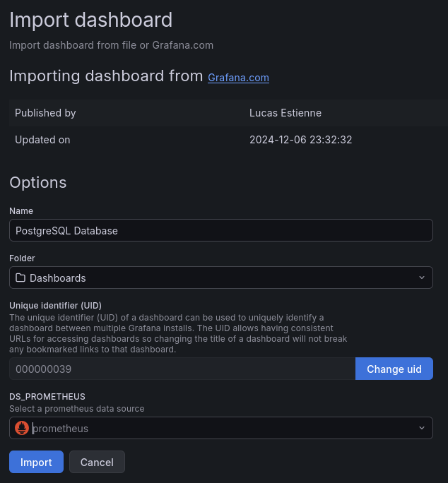


### Verificar

Deberías ver paneles con información como:

- Estado de PostgreSQL.
- Conexiones activas.
- Transacciones por segundo.
- Bloqueos.
- Checkpoints.
- WAL.
- Cache Hit Ratio.
- Tamaño de las bases de datos.


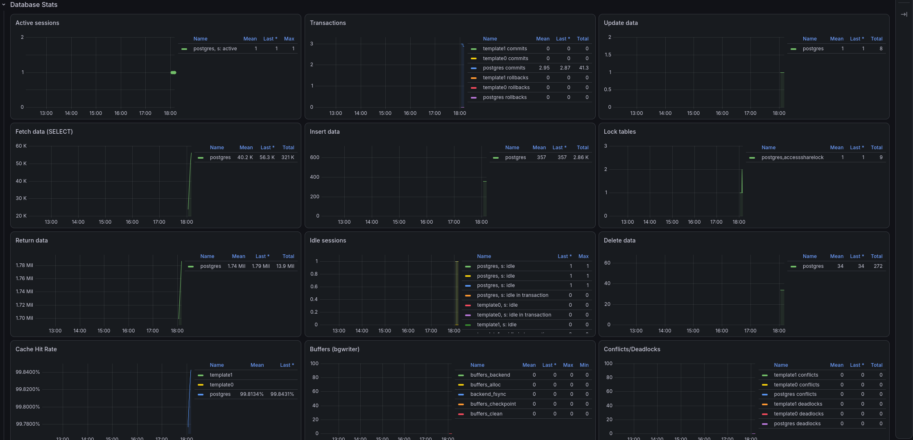


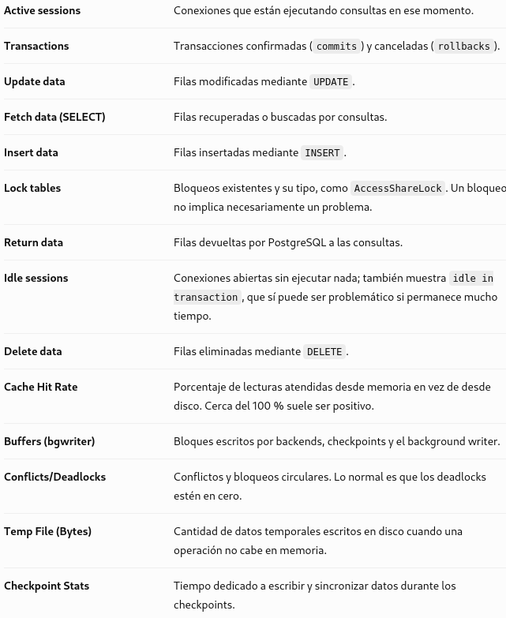


## 5. Monitorizar HAProxy1 y HAProxy2

¿Por qué? Porque es el punto por el que entran todas las aplicaciones. Si HAProxy deja de enrutar correctamente al líder, aunque PostgreSQL esté funcionando, las aplicaciones fallarán.

Con HAProxy Exporter podrás ver, por ejemplo:

- Backend UP/DOWN.
- Qué servidor es el líder.
- Conexiones por segundo.
- Errores HTTP/TCP.
- Estado de los backends.
- Tiempo de respuesta.
- Número de sesiones.

Cuando hagamos un failover con Patroni, verás en Grafana cómo cambia automáticamente el backend activo de HAProxy.

### Habilitar las estadísticas de HAProxy

Hay dos formas de monitorizar HAProxy:

- Usando la página de estadísticas (la más habitual y la que recomiendo para este laboratorio).
- Usando el Runtime API (socket).

En HAProxy-1 y HAProxy-2:

- vi /etc/haproxy/haproxy.cfg

Si no existe añade o modifica:

```ini
listen stats
    # Publica la interfaz de estadísticas en el puerto 7000.
    bind *:7000
    # La interfaz de estadísticas utiliza HTTP.
    mode http
    # Habilita la página de estadísticas.
    stats enable
    # Ruta de acceso a la interfaz.
    stats uri /
    # Refresca automáticamente la página cada 5 segundos.
    stats refresh 5s
```

No vamos a instalar el antiguo haproxy_exporter, porque está retirado; HAProxy incorpora un endpoint Prometheus nativo en versiones compatibles.

### Comprobar soporte nativo

En HAProxy-1:

- haproxy -vv | grep -i prometheus


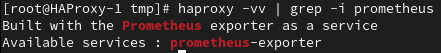


### Añadir el endpoint Prometheus

Mantén tu bloque listen stats y añade al final del fichero /etc/haproxy/haproxy.cfg:

```ini
# =================================================================
# MÉTRICAS PROMETHEUS
# Expone métricas internas de HAProxy para Prometheus.
# =================================================================
frontend prometheus_metrics
    # Puerto donde Prometheus recogerá las métricas.
    bind *:8404
    # Las métricas se publican mediante HTTP.
    mode http
    # Activa el exporter interno de HAProxy cuando se solicita /metrics.
    http-request use-service prometheus-exporter if { path /metrics }
    # Evita generar logs para las peticiones periódicas de Prometheus.
    no log
```

Tu página de estadísticas seguirá disponible en `http://IP_HAPROXY:7000/` y Prometheus recogerá métricas desde `http://IP_HAPROXY:8404/metrics`

El endpoint nativo expone métricas de conexiones, sesiones, frontends, backends y servidores.

### Validar y aplicar

- haproxy -c -f /etc/haproxy/haproxy.cfg

- systemctl reload haproxy

- systemctl status haproxy

Comprueba:

- ss -lntp | grep 8404

- curl -s http://localhost:8404/metrics | head


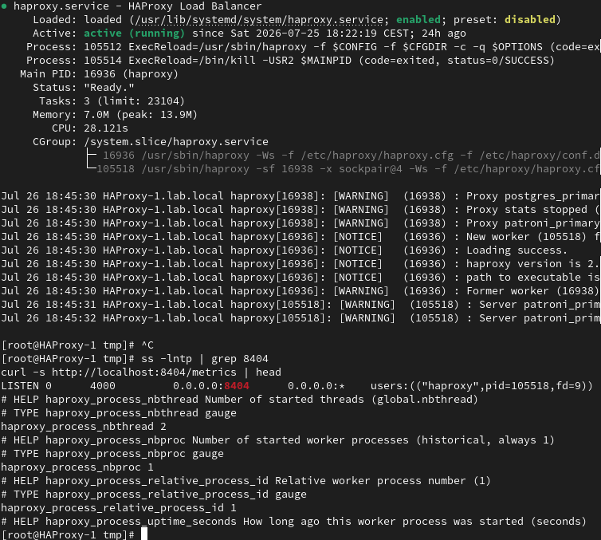


### Repetir en HAProxy-2


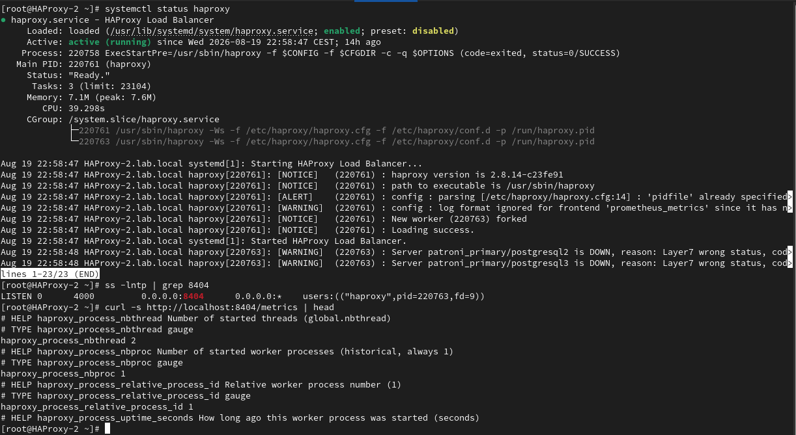


### Abrir puertos

- firewall-cmd --permanent --add-port=8404/tcp

- firewall-cmd --reload

- firewall-cmd --list-ports

- ss -lntp | grep 8404

### Configura Prometheus

- vi /etc/prometheus/prometheus.yml:
```yaml
-Añade dentro de scrape_configs:
# Monitorización de HAProxy.
# Permite conocer el estado de frontends/backends, sesiones,
# conexiones y disponibilidad de los nodos PostgreSQL.
```

 - job_name: "haproxy"

static_configs:

 - targets:

 - "192.168.10.30:8404" # HAProxy-1

 - "192.168.10.31:8404" # HAProxy-2

Valida y reinicia:

- promtool check config /etc/prometheus/prometheus.yml

- systemctl restart prometheus

Luego abre:

[](http://192.168.10.29:9090/targets)

- <http://192.168.10.29:9090/targets>

Debes ver los 2 destinos de postgres_exporter en estado UP.


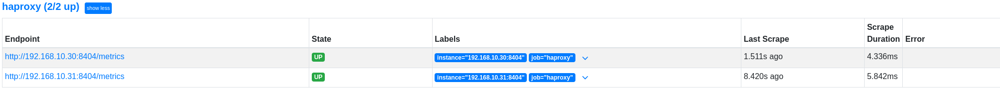


## 6. Monitorizar etcd

etcd expone métricas Prometheus directamente a través del endpoint /metrics del puerto 2379. No es necesario instalar un exporter adicional.

Añadir etcd a Prometheus con etiquetas para dejar nombres claros

- vi /etc/prometheus/prometheus.yml
- Añade dentro de scrape_configs:

```yaml
# Monitorización de etcd: estado de miembros, leader, quorum,
# latencia y salud del almacén distribuido utilizado por Patroni.
- job_name: "etcd"
  metrics_path: /metrics
  static_configs:
    - targets: ["192.168.10.21:2379"] # etcd1 / postgresql1
      labels:
        name: "etcd1"
    - targets: ["192.168.10.22:2379"] # etcd2 / postgresql2
      labels:
        name: "etcd2"
    - targets: ["192.168.10.23:2379"] # etcd3 / postgresql3
      labels:
        name: "etcd3"
    - targets: ["192.168.10.30:2379"] # etcd4 / HAProxy-1
      labels:
        name: "etcd4"
    - targets: ["192.168.10.31:2379"] # etcd5 / HAProxy-2
      labels:
        name: "etcd5"
```

### Valida

- promtool check config /etc/prometheus/prometheus.yml

### Reinicia

- sudo systemctl restart prometheus

- systemctl status prometheus --no-pager

### Comprueba en Prometheus

### Prometheus → Status → Target


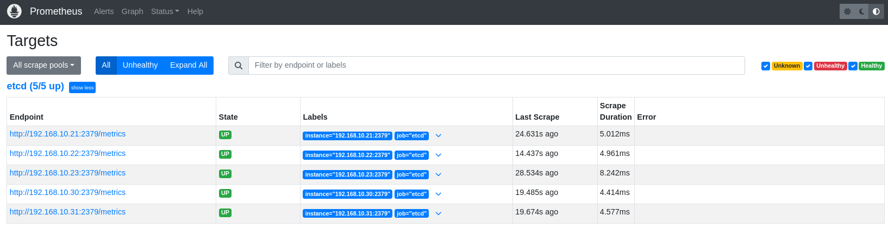


## 7. Monitorización la VIP de Keepalived

Monitorizar desde Prometheus/Grafana qué nodo HAProxy posee actualmente la VIP PostgreSQL 192.168.10.32, actualizando automáticamente la métrica cuando Keepalived realiza un cambio de estado.

### Habilitar métricas personalizadas en Node Exporter

Node Exporter está arrancando sin el textfile collector configurado explícitamente en ambos HAProxy. Se habilita el Textfile Collector de Node Exporter para publicar métricas personalizadas generadas localmente, en este caso destinadas a identificar qué nodo HAProxy posee la VIP de Keepalived.

En HAProxy-1 y HAProxy-2 se crea el directorio del Textfile Collector:

- mkdir -p /var/lib/node_exporter/textfile_collector

- chown -R root:root /var/lib/node_exporter

### Modifica el servicio node_exporter

- systemctl edit --full node_exporter

Añade o modifica:

- ExecStart=/usr/local/bin/node_exporter \\

--collector.textfile.directory=/var/lib/node_exporter/textfile_collector


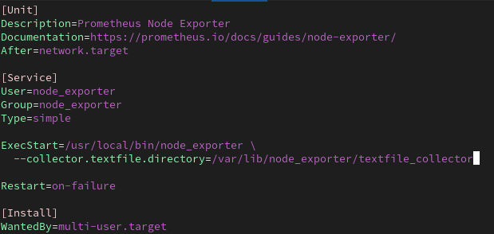


### Aplica

- systemctl daemon-reload

- systemctl restart node_exporter

- systemctl status node_exporter --no-pager

El Textfile Collector permite que Node Exporter publique métricas personalizadas almacenadas en archivos .prom

### Crear el script que actualiza la métrica

En HAProxy-1 y HAProxy-2:

- vi /usr/local/bin/update_keepalived_metric.sh

Contenido:

```bash
#!/bin/bash
# VIP de PostgreSQL gestionada por Keepalived
VIP="192.168.10.32"
# Archivo de métricas que leerá node_exporter
FILE="/var/lib/node_exporter/textfile_collector/keepalived.prom"

# Comprobar si este nodo posee actualmente la VIP
if ip -4 addr show | grep -q "${VIP}"; then
    VALUE=1    # Este nodo tiene la VIP
else
    VALUE=0    # Este nodo no tiene la VIP
fi

# Generar la métrica de Prometheus
cat > "${FILE}.tmp" <<EOF
# HELP keepalived_vip_owner Indicates whether this node owns the PostgreSQL VIP
# TYPE keepalived_vip_owner gauge
keepalived_vip_owner ${VALUE}
EOF

# Reemplazar el archivo de métricas de forma atómica
mv "${FILE}.tmp" "${FILE}"
```

- chmod 755 /usr/local/bin/update_keepalived_metric.sh

El script genera:

- keepalived_vip_owner 1 → cuando el nodo posee la VIP
- keepalived_vip_owner 0 → cuando no la posee la VIP

### Automatizar la actualización mediante systemd

### Crear el servicio

En HAProxy-1 y HAProxy-2:

- vi /etc/systemd/system/keepalived-metric.service
```ini
Contenido:
[Unit]
# Descripción del servicio
Description=Update Keepalived PostgreSQL VIP metric
[Service]
# Ejecuta el script una vez y finaliza
Type=oneshot
# Script que comprueba la VIP y actualiza la métrica
ExecStart=/usr/local/bin/update_keepalived_metric.sh
```

### Crear el timer

- vi /etc/systemd/system/keepalived-metric.timer
```ini
Contenido:
[Unit]
# Descripción del temporizador
Description=Update Keepalived PostgreSQL VIP metric periodically
[Timer]
# Primera ejecución 5 segundos después del arranque
OnBootSec=5s
# Ejecutar el servicio cada 10 segundos
OnUnitActiveSec=10s
# Servicio que ejecutará el temporizador
Unit=keepalived-metric.service
[Install]
# Activar el timer durante el arranque
WantedBy=timers.target
El script se ejecuta automáticamente cada 10 segundos, actualizando la métrica según la ubicación real de la VIP.
```

### Activar el timer

En ambos HAProxy:

- systemctl daemon-reload

- systemctl enable --now keepalived-metric.timer

- systemctl status keepalived-metric.timer --no-pager

### Verificar la métrica localmente

En cada HAProxy:

- cat /var/lib/node_exporter/textfile_collector/keepalived.prom

### Verificar desde Node Exporter

Desde monitoring:

- curl -s http://192.168.10.30:9100/metrics | grep keepalived_vip_owner

- curl -s http://192.168.10.31:9100/metrics | grep keepalived_vip_owner


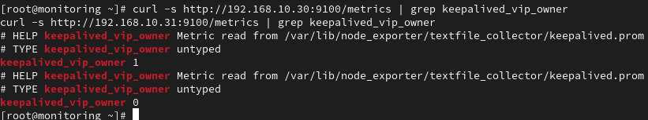


Estado actual:

- HAProxy-1 → keepalived_vip_owner 1
- HAProxy-2 → keepalived_vip_owner 0

Por tanto, HAProxy-1 posee actualmente la VIP PostgreSQL 192.168.10.32.

### Resumen

Keepalived ejecuta automáticamente un script cuando cambia el estado VRRP. El script publica mediante el Textfile Collector de Node Exporter la métrica keepalived_vip_owner, donde 1 identifica al propietario actual de la VIP PostgreSQL y 0 al nodo que no la posee. Esto permite visualizar posteriormente el failover de la VIP desde Prometheus y Grafana.

### Probar detección de la VIP

Primero, en HAProxy-1 y HAProxy-2, ejecuta:

- ip -4 addr show | grep "192.168.10.32"

Esperamos:

- En el nodo MASTER actual → aparecerá 192.168.10.32.
- En el otro → no devolverá nada.

### La VIP está actualmente en HAProxy-1

Con eso creamos después keepalived_vip_owner de forma automática.

### Crear la métrica personalizada

En HAProxy-1:

- echo 'keepalived_vip_owner 1' | sudo tee /var/lib/node_exporter/textfile_collector/keepalived.prom

En HAProxy-2:

- echo 'keepalived_vip_owner 0' | sudo tee /var/lib/node_exporter/textfile_collector/keepalived.prom

Desde monitoring prueba:

- curl -s http://192.168.10.30:9100/metrics | grep keepalived_vip_owner

- curl -s http://192.168.10.31:9100/metrics | grep keepalived_vip_owner


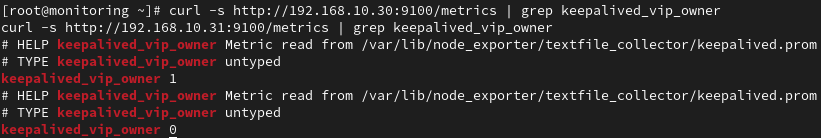


Node Exporter ya publica correctamente la métrica personalizada

Esto nos permitirá crear después el panel Keepalived - Propietario VIP.

## 8. Monitorizar Patroni

Hacer que Prometheus recoja las métricas que Patroni ya expone en el puerto 8008.


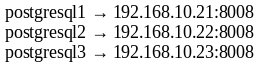


### Configuración

- vi /etc/prometheus/prometheus.yml
```yaml
Añadir dentro de scrape_configs:
# Monitorización de Patroni mediante su API REST.
# Permite observar el estado HA: primary, réplicas,
# PostgreSQL activo, timeline, replicación, etc.
```

 - job_name: "patroni"

metrics_path: /metrics

static_configs:

 - targets:

 - "192.168.10.21:8008" # postgresql1

 - "192.168.10.22:8008" # postgresql2

 - "192.168.10.23:8008" # postgresql3

### Validar y reiniciar

- promtool check config /etc/prometheus/prometheus.yml

- sudo systemctl restart prometheus

- systemctl status prometheus --no-pager

### Ver prometheus

Después entra en: Prometheus → Status → Target health


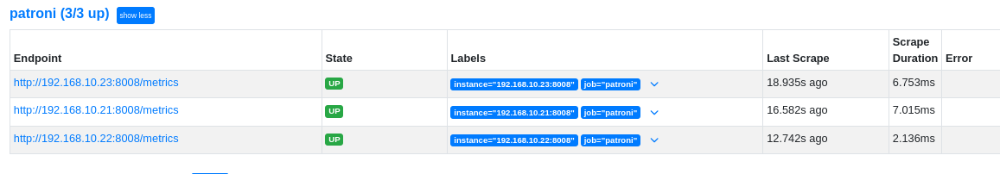
Prometheus ya recoge correctamente las métricas HA de los tres nodos.

## 9. Ver completo el archivo prometheus.yml

```yaml
# ============================================================
# CONFIGURACIÓN GLOBAL DE PROMETHEUS
# ============================================================
global:
  # Prometheus recoge métricas de los targets cada 15 segundos.
  scrape_interval: 15s
  # Evalúa las reglas y alertas configuradas cada 15 segundos.
  evaluation_interval: 15s

# ============================================================
# ALERTMANAGER
# ============================================================
# Define dónde enviará Prometheus las alertas.
# Actualmente no hay ningún Alertmanager configurado.
alerting:
  alertmanagers:
    - static_configs:
        - targets:
          # - alertmanager:9093

# ============================================================
# REGLAS DE ALERTAS
# ============================================================
# Archivos que contendrán las reglas de alerta.
# Se configurarán posteriormente.
rule_files:
  # - "first_rules.yml"
  # - "second_rules.yml"

# ============================================================
# TARGETS MONITORIZADOS
# ============================================================
scrape_configs:
  # Monitorización del propio servidor Prometheus.
  - job_name: "prometheus"
    static_configs:
      - targets:
          - "localhost:9090"

  # Monitorización del sistema operativo mediante Node Exporter.
  # Recoge CPU, RAM, disco, red, carga del sistema, etc.
  # Incluye los 3 PostgreSQL y los 2 HAProxy.
  - job_name: "node_exporter"
    static_configs:
      - targets:
          - "192.168.10.21:9100"  # postgresql1
          - "192.168.10.22:9100"  # postgresql2
          - "192.168.10.23:9100"  # postgresql3
          - "192.168.10.30:9100"  # HAProxy-1
          - "192.168.10.31:9100"  # HAProxy-2

  # Monitorización interna de PostgreSQL mediante postgres_exporter.
  # Recoge conexiones, transacciones, locks, estadísticas de BD, etc.
  - job_name: "postgres_exporter"
    static_configs:
      - targets: ["192.168.10.21:9187"]
        labels:
          name: "postgresql1"
      - targets: ["192.168.10.22:9187"]
        labels:
          name: "postgresql2"
      - targets: ["192.168.10.23:9187"]
        labels:
          name: "postgresql3"

  # Monitorización de HAProxy.
  # Permite conocer el estado de frontends/backends, sesiones,
  # conexiones y disponibilidad de los nodos PostgreSQL.
  - job_name: "haproxy"
    static_configs:
      - targets:
          - "192.168.10.30:8404"  # HAProxy-1
          - "192.168.10.31:8404"  # HAProxy-2

  # Monitorización de Patroni mediante su API REST.
  # Permite observar el estado HA: primary, réplicas,
  # PostgreSQL activo, timeline, replicación, etc.
  - job_name: "patroni"
    metrics_path: /metrics
    static_configs:
      - targets:
          - "192.168.10.21:8008"  # postgresql1
          - "192.168.10.22:8008"  # postgresql2
          - "192.168.10.23:8008"  # postgresql3

  # Monitorización de etcd: estado de miembros, leader, quorum,
  # latencia y salud del almacén distribuido utilizado por Patroni.
  - job_name: "etcd"
    metrics_path: /metrics
    static_configs:
      - targets: ["192.168.10.21:2379"]
        labels:
          name: "etcd1"
      - targets: ["192.168.10.22:2379"]
        labels:
          name: "etcd2"
      - targets: ["192.168.10.23:2379"]
        labels:
          name: "etcd3"
      - targets: ["192.168.10.30:2379"]
        labels:
          name: "etcd4"
      - targets: ["192.168.10.31:2379"]
        labels:
          name: "etcd5"
```

## 10. Otras monitorizaciones

En una empresa podrías monitorizar también:

- Docker
- Kubernetes
- VMware
- Linux
- Windows
- Redis
- Kafka
- RabbitMQ
- Elasticsearch
- Cloudera
- Nginx
- Apache
- Oracle
- MySQL
- MongoDB
- FreeIPA
- DNS
- SAN/NAS
- Switches Cisco
- Balanceadores F5
- Servidores Dell/HPE (iDRAC/iLO)

Prácticamente cualquier producto importante tiene un exporter o una forma de exponer métricas a Prometheus.

