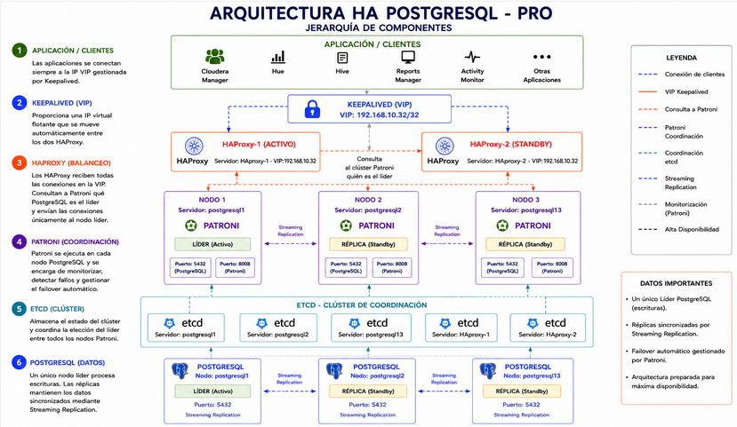

# HA PostgreSQL con Patroni, etcd y HAProxy

Laboratorio propio de despliegue de un clúster PostgreSQL de alta disponibilidad, con monitorización completa mediante Prometheus y Grafana:

- **Sistema operativo:** Rocky Linux 9.8 (5 nodos + 1 nodo de monitorización)
- **PostgreSQL** (3 nodos)
- **etcd** como almacén de coordinación distribuido (5 miembros)
- **Patroni** para failover automático y gestión del clúster
- **HAProxy** + **Keepalived (VIP)** para el enrutamiento de conexiones al líder
- **Prometheus + Grafana** para monitorización, con exporters dedicados para PostgreSQL, HAProxy, etcd, Patroni, el sistema operativo y la VIP

## Contenido

- [`HA_POSTGRESQL.md`](./HA_POSTGRESQL.md) — instalación paso a paso, configuración y validación de la alta disponibilidad (failover de PostgreSQL y de HAProxy).
- [`MONITORIZACION.md`](./MONITORIZACION.md) — instalación de Prometheus, Grafana y los exporters (node_exporter, postgres_exporter, métricas nativas de HAProxy/etcd/Patroni, métrica personalizada de la VIP de Keepalived).
- [`DASHBOARD_GRAFANA.md`](./DASHBOARD_GRAFANA.md) — construcción del dashboard "PostgreSQL HA - Overview" panel a panel, con 3 pruebas de alta disponibilidad reales (switchover controlado, failover de la VIP, validación de estados de fallo).
- [`FALLOS.md`](./FALLOS.md) — incidencias reales encontradas durante el despliegue, con causa raíz y solución aplicada.
- [`media/diagrams/arquitectura_ha_postgresql.png`](./media/diagrams/arquitectura_ha_postgresql.png) — diagrama de la arquitectura: jerarquía de componentes y flujo desde el cliente (vía VIP) hasta el líder de Patroni.

## Arquitectura

## Notas

- Las contraseñas de los documentos están anonimizadas (`<POSTGRES_PASSWORD>`, `<REPLICATOR_PASSWORD>`, `<REWIND_PASSWORD>`, `<EXPORTER_PASSWORD>`); sustitúyelas por tus propios valores si reproduces el laboratorio.
- Las credenciales iniciales de Grafana (`admin`/`admin`) son las que trae por defecto — cámbialas en el primer login.
